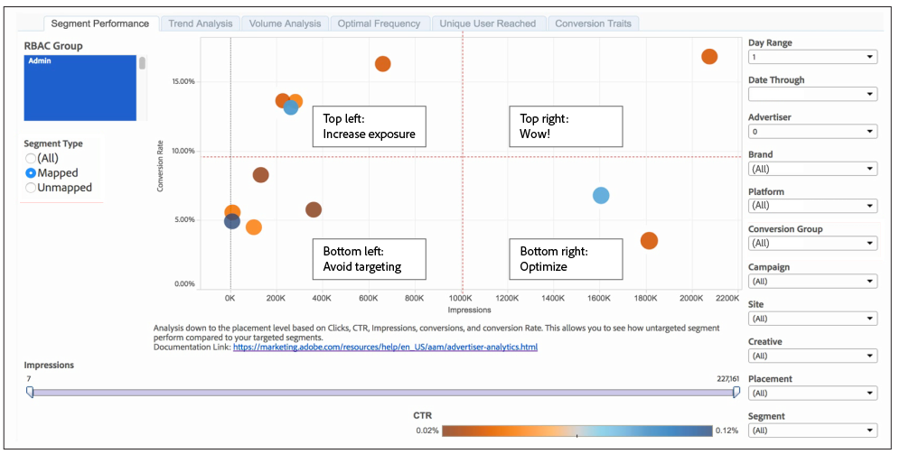

# Rapporto sulle prestazioni dei segmenti{#segment-performance-report}

Il [!UICONTROL Segment Performance] rapporto confronta i segmenti mappati e non mappati per impression e tassi di conversione. Un segmento mappato è un segmento creato e inviato a una destinazione per il targeting. Un segmento non mappato è un segmento creato ma non inviato a una destinazione per il targeting. Confrontando questi diversi tipi di segmenti all&#39;interno e tra i rapporti è possibile ottimizzare le campagne esistenti e individuare i segmenti trascurati che è possibile inviare a una destinazione per il targeting.

## Come leggere i risultati dei segmenti mappati {#read-mapped-segment-results}

Il [!UICONTROL Segment Performance] rapporto mappato visualizza tutti i segmenti creati e inviati a una destinazione per il targeting. La posizione dei segmenti mappati in un rapporto può fornire informazioni dettagliate sui segmenti che hanno prestazioni migliori e sui punti in cui potrebbe essere necessario apportare alcune modifiche.

Per leggere il rapporto, esso aiuta a dividere i risultati in 4 sezioni con linee immaginarie (in rosso) e le categorie mostrate nel rapporto di esempio riportato di seguito.

Le etichette contenute nell&#39;esempio e nella tabella seguente consentono di comprendere le prestazioni dei segmenti e come rispondere a tali risultati.

<table id="table_A29253B30DFA4CD7B3B7C320DE0BDEA4"> 
 <thead> 
  <tr> 
   <th colname="col1" class="entry"> Posizione </th> 
   <th colname="col2" class="entry"> Posizionamento indica </th> 
  </tr> 
 </thead>
 <tbody> 
  <tr> 
   <td colname="col1"> 
 <b>In alto a sinistra</b> 
 </td> 
   <td colname="col2"> 
Buoni tassi di conversione. 
 
Potreste essere in grado di ottenere più conversioni aumentando le impression. 
 </td> 
  </tr> 
  <tr> 
   <td colname="col1"> 
 <b>In basso a sinistra</b> 
 </td> 
   <td colname="col2"> 
Tassi di conversione ridotti. 
 
È possibile evitare di eseguire il targeting di questi segmenti. I segmenti in questa sezione sono ottimi candidati per il confronto con quelli nei risultati dei segmenti non mappati. Alcuni dei segmenti non mappati potrebbero funzionare meglio dei segmenti già impostati per il targeting. 
 </td> 
  </tr> 
  <tr> 
   <td colname="col1"> 
 <b>In alto a destra</b> 
 </td> 
   <td colname="col2"> 
Prestazioni elevate. Lasciate soli questi segmenti. 
 </td> 
  </tr> 
  <tr> 
   <td colname="col1"> 
 <b>In basso a destra</b> 
 </td> 
   <td colname="col2"> 
Tassi di conversione ridotti e impression elevate. 
 
I segmenti in questa sezione non funzionano bene. Potresti voler spostare il budget da questi segmenti a segmenti nel quadrante in alto a sinistra del report. In questo modo sarà possibile ridurre le impression e migliorare i tassi di conversione per i segmenti in questa sezione in basso a destra. Inoltre, confronta questi segmenti mappati con i tuoi segmenti non mappati. Alcuni dei segmenti non mappati potrebbero funzionare meglio dei segmenti già impostati per il targeting. 
 </td> 
  </tr> 
 </tbody> 
</table>

## Come leggere i risultati dei segmenti non mappati {#read-unmapped-segment-results}

Osservare i segmenti non mappati in un [!UICONTROL Segment Performance] report è un ottimo modo per trovare nuovi segmenti che non hai considerato per il targeting. In realtà, alcuni di questi segmenti potrebbero superare i segmenti mappati. Questo perché un segmento non mappato deve soddisfare una serie di criteri di qualifica da includere in questo rapporto. Per essere incluso in questo rapporto, un segmento non mappato deve:

* Conversioni maggiori della media di tutti i segmenti mappati.
* I primi 100 segmenti non mappati in base al tasso di conversione.

Per leggere questo rapporto, aiuta a dividere i risultati in 4 sezioni con linee immaginarie (in rosso) e categorie indicate nel rapporto di esempio seguente.

In questo rapporto, vuoi concentrarti solo sui segmenti non mappati nella sezione in alto a sinistra. Questi segmenti non mappati presentano tassi di conversione elevati per un basso livello di impression rispetto ai segmenti delle altre tre sezioni.

>[!NOTE]
>
>I periodi di lookback di 7 giorni e 30 giorni sono disponibili solo per le **[!UICONTROL Date Through]** date della domenica.
