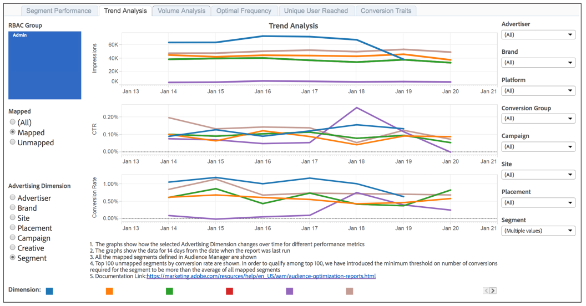

# [!UICONTROL Trend Analysis] e [!UICONTROL Volume Analysis] report{#trend-analysis-and-volume-analysis-reports}

Questi report restituiscono dati sulle impression, i tassi di click-through e le conversioni per un&#39;ampia gamma di dimensioni pubblicitarie. Confronta tendenze e volume per le metriche selezionate per ottenere un quadro migliore delle prestazioni della campagna nel tempo.

## Esempio [!UICONTROL Trend Analysis] di rapporto {#sample-trend-analysis}

Il [!UICONTROL Trend Analysis] rapporto restituisce i dati in un grafico a linee solo per un intervallo di 14 giorni. In questo esempio, il rapporto mostra tendenze di impression, click-through e conversione per un insieme di segmenti mappati.

## Esempio [!UICONTROL Volume Analysis] di rapporto {#sample-volume-analysis}

Il [!UICONTROL Volume Analysis] rapporto restituisce i dati sotto forma di grafico a barre per l&#39;intervallo di date selezionato. In questo esempio, il rapporto mostra impression, click-through e conversioni per volume per un set di segmenti mappati.

>[!NOTE]
>
>I periodi di lookback di 7 giorni e 30 giorni sono disponibili solo per le **[!UICONTROL Date Through]** date della domenica.

>[!TIP]
>
>Per informazioni sui segmenti mappati e non mappati, consulta la documentazione Report [prestazioni](../../../reporting/audience-optimization-reports/aor-advertisers/segment-performance.md) segmento.

