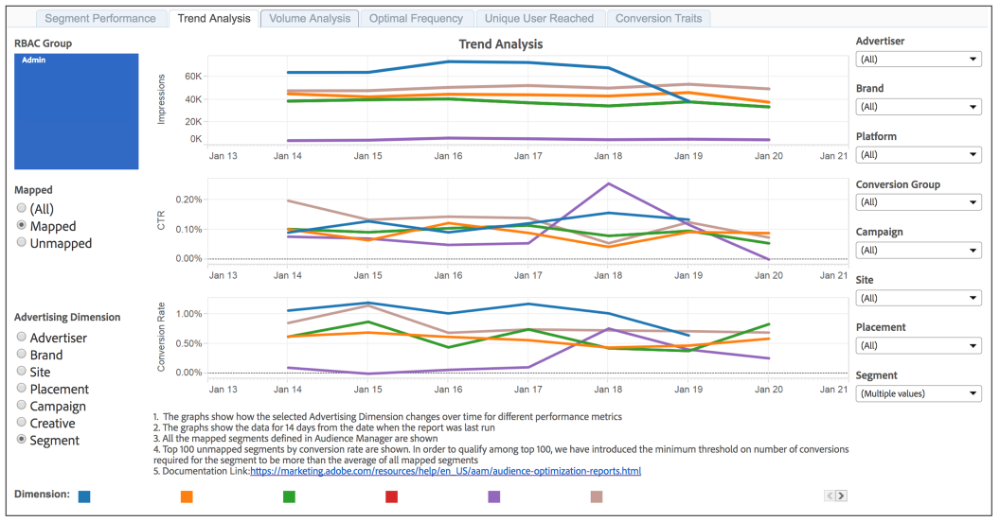

# [!UICONTROL Trend Analysis] e [!UICONTROL Volume Analysis] report{#trend-analysis-and-volume-analysis-reports}

Questi rapporti restituiscono dati su impression, tassi di click-through e conversioni per un’ampia gamma di dimensioni pubblicitarie. Confronta le tendenze e il volume per le metriche selezionate per ottenere un’immagine migliore delle prestazioni della campagna nel tempo.

## Esempio di report [!UICONTROL Trend Analysis] {#sample-trend-analysis}

Il report [!UICONTROL Trend Analysis] restituisce dati in un grafico a linee solo per un intervallo di 14 giorni. In questo esempio, il rapporto mostra le tendenze di impression, click-through e conversione per un set di segmenti mappati.

## Esempio di report [!UICONTROL Volume Analysis] {#sample-volume-analysis}

Il report [!UICONTROL Volume Analysis] restituisce i dati in un grafico a barre per l&#39;intervallo di date selezionato. In questo esempio, il rapporto mostra impression, click-through e conversioni per volume per un set di segmenti mappati.

>[!NOTE]
>
>I periodi di look-back di 7 giorni e 30 giorni sono disponibili solo per le date di domenica **[!UICONTROL Date Through]**.

>[!TIP]
>
>Per informazioni sui segmenti mappati e non mappati, consulta la documentazione del [Rapporto sulle prestazioni dei segmenti](../../../reporting/audience-optimization-reports/aor-advertisers/segment-performance.md).
