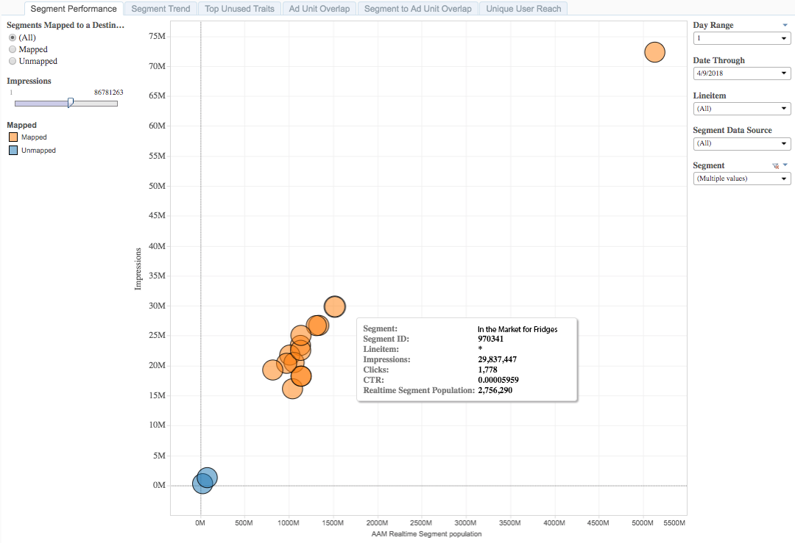

# Segment Performance Report{#segment-performance-report}

Il rapporto Performance Performance (Prestazioni segmento) confronta i segmenti mappati e non mappati con impression e con Uniques segmento Real-Time.

Un segmento mappato è un segmento che crei e invia a una destinazione per il targeting. Un segmento non mappato è un segmento che hai creato ma non è stato inviato a una destinazione per il targeting.

Il confronto tra questi tipi di segmenti diversi all'interno e tra i rapporti consente di ottimizzare le campagne esistenti e individuare segmenti trascurati che potresti desiderare inviare a una destinazione per il targeting.

## Casi d'uso {#use-cases}

With the [!UICONTROL Segment Performance] report, you can:

* Identifica segmenti di pubblico mappati che stimolano la scala o le prestazioni.
* Identifica i segmenti non mappati da introdurre in campagne future, in base al contributo di un pubblico alle prestazioni passate.

## Using the Segment Performance Report {#using-segment-performance-report}

Toggle between **[!UICONTROL Mapped]** and **[!UICONTROL Unmapped]** to select segments that are mapped to a destination or not. Select **[!UICONTROL All]** to include all your segments in the report.

Use the **Day Range** and **Date Through** controls to adjust your look-back range. I periodi di look-back di 7 giorni e 30 giorni sono disponibili solo per le date domenica.

Use the **[!UICONTROL Line Item]** drop-down box to select the web properties for which you want to return information.

In the **[!UICONTROL Segment Data Source]** drop-down box, select the data sources containing the segments you want to see in the report.

Use the **[!UICONTROL Segment]** drop-down box to select which segments you want to see in the report.

>[!IMPORTANT]
>
>When enabling [!UICONTROL Audience Optimization for Publishers], you must include descriptive metadata for [!UICONTROL Line Item IDs], as described in Step 3 of [Import DFP Data Files Into Audience Manager](../../../reporting/audience-optimization-reports/aor-publishers/import-dfp.md). By doing this, you assure that the report details the web property as [!UICONTROL Line Item] instead of the [!UICONTROL Line Item ID].

## Interpreting the Results {#interpreting-results}

[!UICONTROL Segment Performance] Il rapporto potrebbe essere simile a quello di seguito. Nel rapporto, fai clic su una bolla per visualizzare i dati sottostanti. Vedere descrizioni per le informazioni aggiuntive nella tabella sotto il rapporto campione.

<table id="table_AFE2540583C34835B04584693ADFD26A"> 
 <thead> 
  <tr> 
   <th colname="col1" class="entry"> Elemento </th> 
   <th colname="col2" class="entry"> Descrizione </th> 
  </tr>
 </thead>
 <tbody> 
  <tr> 
   <td colname="col1"> 
Segmento 
 </td> 
   <td colname="col2"> 
Il nome alfanumerico assegnato a questo segmento. 
 </td> 
  </tr> 
  <tr> 
   <td colname="col1"> 
ID segmento 
 </td> 
   <td colname="col2"> 
L'ID univoco di questo segmento. 
 </td> 
  </tr> 
  <tr> 
   <td colname="col1"> 
Elemento linea 
 </td> 
   <td colname="col2"> 
La proprietà Web per la quale stai visualizzando il rapporto. 
 </td> 
  </tr> 
  <tr> 
   <td colname="col1"> 
Clic 
 </td> 
   <td colname="col2"> 
Numero di volte in cui i membri di questa caratteristica hanno fatto clic sugli elementi nella proprietà Web. 
 </td> 
  </tr> 
  <tr> 
   <td colname="col1"> 
Impressioni 
 </td> 
   <td colname="col2"> 
Numero di volte in cui i membri di questa caratteristica sono stati esposti alle scorte. 
 </td> 
  </tr> 
  <tr> 
   <td colname="col1"> 
CTR 
 </td> 
   <td colname="col2"> 
Tasso di click-through. 
 
Questa metrica rimuove la percentuale di impression seguito dai clic. Divide i clic per impression per ottenere questa metrica. 
 </td> 
  </tr> 
  <tr> 
   <td colname="col1"> 
Popolazione segmenti in tempo reale 
 </td> 
   <td colname="col2"> 
The actual number of unique visitors seen in real-time for the specified time range and who were qualified for the segment at the moment they were seen by  Audience Manager. 
 </td> 
  </tr> 
 </tbody> 
</table>

## How to Read Your Mapped Segment Results {#read-mapped-segment}

La posizione dei segmenti mappati in un rapporto può indicare molto sui segmenti che funzionano bene e dove potrebbe essere necessario apportare alcune modifiche.

Per leggere il rapporto, è utile dividere i risultati in quattro sezioni con righe immaginarie (in rosso) e le categorie mostrate nel rapporto di esempio sottostante. Le etichette dell'esempio possono aiutarti a comprendere le prestazioni dei segmenti e a come rispondere a tali risultati.

## How to Read Your Unmapped Segment Results {#read-unmapped-segment}

Looking at unmapped segments in a [!UICONTROL Segment Performance] report is a great way to find new segments you haven't considered for targeting. In effetti, alcuni di questi segmenti possono prevalere sui segmenti mappati.

Per leggere questo rapporto, è utile dividere i risultati in quattro sezioni con righe immaginarie (in rosso) e categorie mostrate nel rapporto di esempio sottostante.

