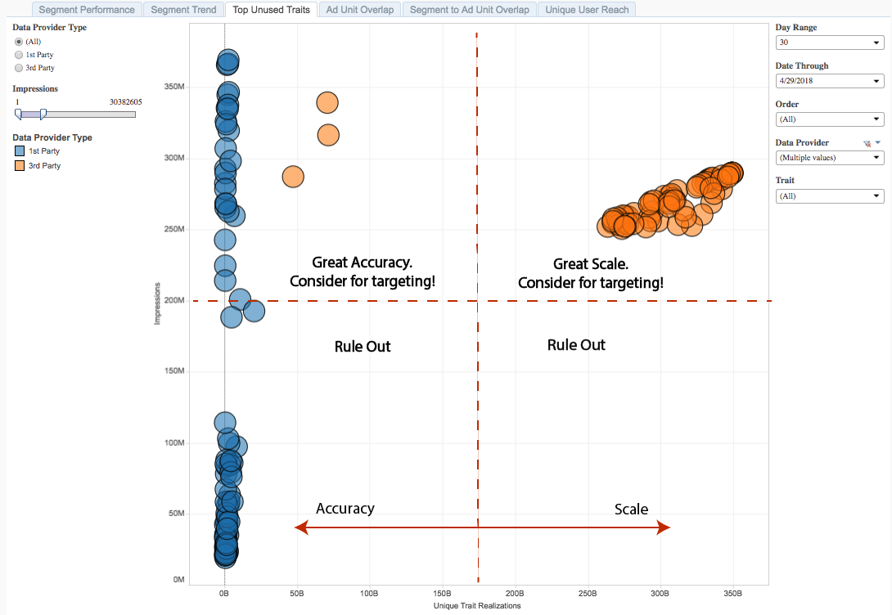

# Principali caratteristiche non utilizzate{#top-unused-traits}

Le caratteristiche principali non utilizzate sono rappresentate come un diagramma a dispersione delle caratteristiche che non sono ancora membri di un segmento, in base al tipo di caratteristica, all'origine dati e alle prestazioni.

## Caso d'uso {#use-cases}

Con il [!UICONTROL Top Unused Traits] rapporto, puoi analizzare e confrontare le prestazioni di caratteristiche di prime e terze parti che attualmente non sono mappate a un segmento. Questa visualizzazione può evidenziare le caratteristiche migliori da utilizzare in un segmento di pubblico per l'ottimizzazione delle campagne o per la rete di nuove opportunità.

## Utilizzo del report Caratteristiche principali non utilizzate {#using-the-report}

Usate i **[!UICONTROL Data Provider Type]** controlli per alternare tra caratteristiche di prime parti e terze parti. Selezionare **[!UICONTROL All]** per restituire caratteristiche di prima e terza parte nel rapporto.

Con il **[!UICONTROL Impressions]** cursore, potete selezionare un valore minimo e massimo per le impression restituite. Eventuali caratteristiche responsabili di un numero inferiore o superiore ai limiti impostati non vengono visualizzate nel rapporto.

Utilizzate i controlli **[!UICONTROL Day Range]** e **[!UICONTROL Date Through]** per regolare la gamma di look-back. Per questo rapporto è disponibile solo il periodo di lookback di 30 giorni.

Utilizzate la casella a **[!UICONTROL Order]** discesa per selezionare le proprietà Web del portfolio per cui desiderate restituire informazioni.

Nella casella a **[!UICONTROL Data Provider]** discesa, seleziona le origini dati contenenti le caratteristiche che desideri vedere nel rapporto.

Utilizzate la casella a **[!UICONTROL Traits]** discesa per selezionare le caratteristiche da visualizzare nel rapporto.

>[!IMPORTANT]
>
>Quando [!UICONTROL Audience Optimization for Publishers]abilitate, dovete includere metadati descrittivi per [!UICONTROL Order IDs], come descritto nel passaggio 3 di [Importazione di file di dati DFP in Audience Manager](../../../reporting/audience-optimization-reports/aor-publishers/import-dfp.md). A questo scopo, assicuratevi che nel rapporto sia indicata la proprietà Web come [!UICONTROL Order] anziché come [!UICONTROL Order ID].

## Interpretazione dei risultati {#interpreting-results}

**Report di esempio**

Il tuo [!UICONTROL Top Unused Traits] rapporto potrebbe essere simile a quello riportato di seguito. Nel rapporto, fai clic su una bolla per visualizzare i dati sottostanti.

Vedere le descrizioni per le informazioni aggiuntive nella tabella sotto il rapporto campione.

<table id="table_AFE2540583C34835B04584693ADFD26A"> 
 <thead> 
  <tr> 
   <th colname="col1" class="entry"> Elemento </th> 
   <th colname="col2" class="entry"> Descrizione </th> 
  </tr>
 </thead>
 <tbody> 
  <tr> 
   <td colname="col1"> 
 Tipo provider dati 
 </td> 
   <td colname="col2"> 
Specifica se l'origine dati selezionata contiene caratteristiche di prime parti o terze parti. 
 </td> 
  </tr> 
  <tr> 
   <td colname="col1"> 
 ID caratteristica 
 </td> 
   <td colname="col2"> 
ID univoco di questa caratteristica. 
 </td> 
  </tr> 
  <tr> 
   <td colname="col1"> 
 Nome caratteristica 
 </td> 
   <td colname="col2"> 
Nome alfanumerico assegnato a questa caratteristica da voi o dal provider di dati. 
 </td> 
  </tr> 
  <tr> 
   <td colname="col1"> 
 Ordine 
 </td> 
   <td colname="col2"> 
Proprietà Web per la quale viene visualizzato il rapporto. 
 </td> 
  </tr> 
  <tr> 
   <td colname="col1"> 
 Impressioni 
 </td> 
   <td colname="col2"> 
Il numero di volte in cui i membri di questa caratteristica sono stati esposti al tuo inventario. 
 </td> 
  </tr> 
  <tr> 
   <td colname="col1"> 
 Caratteristiche tecniche 
 </td> 
   <td colname="col2"> 
Numero di membri delle caratteristiche negli ultimi 30 giorni. 
 </td> 
  </tr> 
 </tbody> 
</table>

La posizione delle caratteristiche in un report può fornire informazioni dettagliate sulle caratteristiche che è possibile utilizzare per ottimizzare i segmenti di pubblico esistenti.

Le caratteristiche situate più in alto sull’asse Impressioni sono quelle che desiderate usare nelle campagne. Per le caratteristiche con un numero limitato di impression, è improbabile che si stia raggiungendo questo pubblico sulla proprietà Web, in base ai dati DFP.

Osservate a sinistra dell' [!UICONTROL Unique Trait Realizations] asse per ottenere caratteristiche estremamente precise e a destra per quelle che possono essere ridimensionate.

<table id="table_A29253B30DFA4CD7B3B7C320DE0BDEA4"> 
 <thead> 
  <tr> 
   <th colname="col1" class="entry"> Posizione </th> 
   <th colname="col2" class="entry"> Posizionamento indica </th> 
  </tr> 
 </thead>
 <tbody> 
  <tr> 
   <td colname="col1"> 
 <b>In alto a sinistra</b> 
 </td> 
   <td colname="col2"> 
Numero elevato di impression, numero ridotto di realizzazioni di caratteristiche. 
 
Si tratta di un pubblico altamente preciso che non è ancora membro di un segmento. Considerate la possibilità di eseguire il targeting. 
 </td> 
  </tr> 
  <tr> 
   <td colname="col1"> 
 <b>In basso a sinistra</b> 
 </td> 
   <td colname="col2"> 
Numero basso di impression, numero basso di realizzazioni di caratteristiche. 
 
 Escludete queste caratteristiche, in quanto i membri non contribuiscono alle impressioni sulle vostre proprietà Web. 
 </td> 
  </tr> 
  <tr> 
   <td colname="col1"> 
 <b>In alto a destra</b> 
 </td> 
   <td colname="col2"> 
Numero elevato di impression, numero elevato di realizzazioni di caratteristiche. 
 
Una portata elevata contro un pubblico che non è ancora indicato in un segmento. Questo pubblico è un candidato ideale per il targeting a causa dell'alto numero di impression e della scala. 
 </td> 
  </tr> 
  <tr> 
   <td colname="col1"> 
 <b>In basso a destra</b> 
 </td> 
   <td colname="col2"> 
Numero basso di impression, numero elevato di realizzazioni di caratteristiche. 
 
 Potete escludere queste caratteristiche, in quanto i membri non contribuiscono alle impressioni sulle proprietà Web. 
 </td> 
  </tr> 
 </tbody> 
</table>
