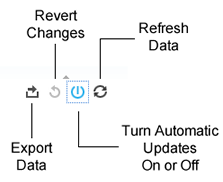

# Tecnologia di report{#report-technology}

Descrive il software sottostante che abilita i report interattivi e la pianificazione dell'aggiornamento dei dati.

<!-- 

c_report_technology.xml

 -->

## Report interattivi che utilizzano la tecnologia Tableau

[!DNL Audience Manager] utilizza il software [Tableau](https://www.tableausoftware.com/) per visualizzare i dati nei rapporti interattivi. Con [!DNL Tableau], i [!UICONTROL Delivery and Overlap] rapporti utilizzano suggerimenti visivi e simboli che consentono di:

* Trovate caratteristiche ad alte e basse prestazioni.
* Caratteristiche e segmenti spot con sovrapposizione di visitatore univoca bassa e alta.
* Utilizzate i dati di sovrapposizione per creare segmenti mirati.
* Ampliate la portata identificando le caratteristiche correlate con una sovrapposizione ridotta.

## Pianificazione aggiornamento dati

I dati del rapporto vengono aggiornati ogni domenica. L'aggiornamento elabora i dati da sabato (il giorno precedente) alla domenica precedente.

## Forme, colori e dimensioni utilizzati nei rapporti interattivi {#shapes-colors-sizes}

La maggior parte dei rapporti interattivi visualizza i risultati utilizzando forme di dimensioni e colori diversi. Questo formato di visualizzazione è progettato per aiutarti a comprendere i dati visivamente, senza dover scorrere righe e colonne di numeri.

<!-- 

r_legend.xml

 -->

### Legenda report

La tabella seguente definisce le forme, le dimensioni e i colori utilizzati nei rapporti dinamici.

<table id="table_EC180A96E3784FC6B81FCFB546C4A3FA"> 
 <thead> 
  <tr> 
   <th colname="col1" class="entry"> Elemento dati </th> 
   <th colname="col2" class="entry"> Descrizione </th> 
  </tr> 
 </thead>
 <tbody> 
  <tr> 
   <td colname="col1"> <b>Forme</b> </td> 
   <td colname="col2"> 
    <ul id="ul_076773ABD0BB4CE6834ACFA8B3D6AC2E"> 
     <li id="li_BBAB37A6EC1549B48C0E4D3BFAF7062C">I cerchi indicano le proprie caratteristiche di prime parti. </li> 
     <li id="li_371331AE984A4A999CE0596EA13987E0">I quadrati indicano caratteristiche di terze parti. </li> 
    </ul> </td> 
  </tr> 
  <tr> 
   <td colname="col1"> <b>Colori</b> </td> 
   <td colname="col2"> 
    <ul id="ul_F5D243297F0C4E5A8EDCBD28A548869E"> 
     <li id="li_332EB873A35440E6BB6093E36A0FAC3D">Le sfumature rosse indicano una sovrapposizione <i>bassa</i> . </li> 
     <li id="li_29DFDB1218DF4069B5DCFF841D48EF56">Le sfumature verdi indicano una sovrapposizione <i>elevata</i> . </li> 
    </ul> </td> 
  </tr> 
  <tr> 
   <td colname="col1"> <b>Dimensioni</b> </td> 
   <td colname="col2"> Le dimensioni aumentano o diminuiscono in proporzione diretta per raggiungere (il numero o la % di clic o di utenti univoci in una caratteristica o segmento). </td> 
  </tr> 
 </tbody> 
</table>

## Informazioni su icone e strumenti del rapporto {#icons-tools-explained}

Descrive come cercare e utilizzare i vari strumenti per le icone utilizzati nei rapporti dinamici.

<!-- 

r_icons.xml

 -->

### Icone e strumenti dati

Le icone e gli strumenti riportati di seguito sono disponibili nella parte inferiore di ogni finestra di rapporto dinamico. L'illustrazione seguente fornisce ulteriori informazioni su questi strumenti.

### Esporta dati

Questi strumenti consentono di esportare i dati dal rapporto in 4 formati diversi.

| Opzione di esportazione | Esporta dati |
|---|---|
| **[!UICONTROL Image]** | Come file di immagine (.png). Utile per scaricare e condividere i dati dei rapporti nel formato grafico originale. |
| **[!UICONTROL PDF]** | Come file PDF. |
| **[!UICONTROL Data]** | In una nuova finestra del browser come dati numerici in colonne e righe. |
| **[!UICONTROL Crosstab]** | Come file .csv. |

### Ripristino modifiche

Selezionare questo strumento per annullare eventuali modifiche interattive apportate al clic sul rapporto.

### Aggiornamenti automatici

I [!UICONTROL Delivery-Performance] [!UICONTROL Trait-to-Trait Overlap] rapporti e i rapporti sono rapporti dinamici che rispondono e cambiano in base alle azioni di clic dell'utente.

Ad esempio, supponiamo di voler selezionare diversi inserzionisti nel [!UICONTROL Overlap] rapporto. Quando questa opzione è attivata, gli aggiornamenti automatici iniziano a restituire i dati non appena si seleziona una casella di controllo. Questo comportamento dinamico può interrompere il flusso di lavoro perché è necessario attendere il termine dell'elaborazione del rapporto prima di selezionare un altro inserzionista. Utilizzate questo strumento per disattivare (e riattivare) la funzione come necessario.

### Aggiorna dati

Fate clic sull'icona di aggiornamento per eseguire un rapporto o ricaricare il set di dati. Quando gli aggiornamenti automatici sono disattivati, fai clic su Aggiorna per eseguire o aggiornare il rapporto.

### Strumento Ricerca

La ricerca è rappresentata da un'icona generica di lente di ingrandimento (non mostrata). Il campo di ricerca viene nascosto finché non si fa clic sulle etichette di selezione sul lato sinistro dello schermo. La tabella seguente descrive la posizione dello strumento di ricerca per ciascun rapporto.

| Report | Per trovare una ricerca, passa il mouse sopra |
|---|---|
| [!UICONTROL Delivery and Performance] rapporto | Etichetta "Advertiser Name". |
| [!UICONTROL Overlap] report | Etichetta "SID Name". |
