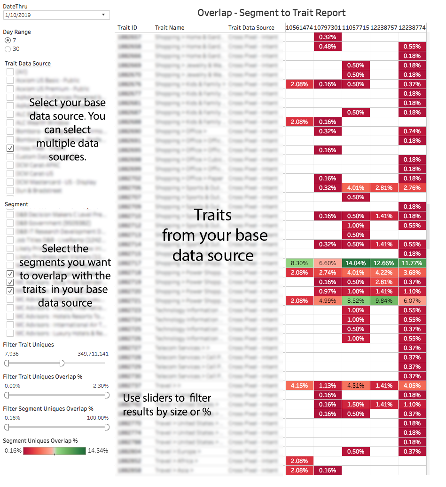

# Rapporto di sovrapposizione segmento-caratteristica{#segment-to-trait-overlap-report}

Restituisce i dati sul numero di utenti univoci condivisi tra una caratteristica particolare e un intero segmento.

>[!NOTE]
>
>I rapporti di sovrapposizione in Audience Manager aderiscono ai principi RBAC. You can only see segments and traits from data sources that you have access to based on the [RBAC User Group](/help/using/features/administration/administration-overview.md) that you belong to.

<!-- 

c_segment_trait_overlap.xml

 -->

## Panoramica

As an optimization tool, the [!UICONTROL Segment to Trait Overlap] reports helps you build highly focused segments or expand segment reach. Ad esempio, potete creare segmenti e caratteristiche mirati con sovrapposizione elevata per raggiungere un pubblico specifico. Tuttavia, la sovrapposizione può comportare un numero minore di utenti univoci (meno raggiungibili). Questo rapporto consente di espandere la portata rimuovendo le caratteristiche con molti segmenti sovrapposti e sostituendo le caratteristiche con meno sovrapposizioni.

### Report di esempio

The following illustration provides a high-level overview of the [!UICONTROL Segment-to-Trait Overlap] report.

### Approfondire i singoli punti di dati

Selezionate un singolo punto per visualizzare i dettagli dei dati in una finestra a comparsa. Le azioni di clic aggiornano automaticamente i dati visualizzati nel rapporto.

## Comparing Segments to Traits {#comparing-segments-to-traits}

Descrive come confrontare segmenti e caratteristiche per ricavare informazioni significative dai risultati.

<!-- 

c_compare_s2t.xml

 -->

### Confronto tra Caratteristiche e Segmento segmento: Esempio

Inizialmente, potrebbe sembrare logico confrontare i segmenti con caratteristiche e tentare di disegnare conclusioni dai risultati. Dopo tutto, i segmenti e le caratteristiche sono diversi, pertanto in che modo i dati derivati da elementi diversi hanno un significato? In questo caso, tuttavia, non stiamo confrontando caratteristiche e segmenti, ma il numero di visitatori unici condivisi tra loro. Il conteggio dei visitatori univoci condiviso fornisce il valore comune che rende possibile un segmento al confronto delle caratteristiche.

Il diagramma seguente illustra la relazione tra una caratteristica e il segmento a cui appartiene. In questo caso, abbiamo una caratteristica con 10 visitatori e un segmento con 1,000 visitatori. Condividono 3 visitatori unici in comune.

Il conteggio dei visitatori univoci è il valore comune costante condiviso tra queste diverse classi di oggetti. Di conseguenza, puoi determinare l'unico rapporto visitatore tra di essi, come segue:

* Il trait condivide il 30% dei visitatori unici con il segmento (3/10 = 0.30).
* Il segmento condivide il 0.3% dei visitatori unici con la caratteristica (3/1,000 = 0.003)

### Trova valore nel segmento a confronti caratteristiche

La sovrapposizione tra caratteristiche e segmenti può aiutarti a stimare il pool di visitatori (previsioni) disponibili o a trovare segmenti inefficienti con eccessiva sovrapposizione.

<table id="table_5B211EF95216426299EB20253A5A9C1B"> 
 <thead> 
  <tr> 
   <th colname="col1" class="entry"> Caso d'uso </th> 
   <th colname="col2" class="entry"> Descrizione </th> 
  </tr>
 </thead>
 <tbody> 
  <tr> 
   <td colname="col1"><b>Previsioni</b> </td> 
   <td colname="col2"> 
Per determinare il pool di visitatori disponibili, somma la differenza tra il totale della caratteristica (sovrapposizione minore) e il totale del segmento (minore sovrapposizione). 
 
Questa combinazione di segmenti può raggiungere fino a 1004 nuovi utenti. 
 </td> 
  </tr> 
  <tr> 
   <td colname="col1"><b>Trovare segmenti inefficienti</b> </td> 
   <td colname="col2"> 
If a trait is part of an  AND group in a segment definition, the unique visitors who have that trait are already in the segment and not available for adding to the segment. Puoi usare questo rapporto per trovare caratteristiche rilevanti con sovrapposizione bassa e aggiungerle alla definizione del segmento, aumentando quindi la portata di quel pool di pubblico. 
 </td> 
  </tr> 
 </tbody> 
</table>

## Understanding the Data Filters in the Segment-to-Trait Overlap Report {#data-filters-s2t-report}

Descrive il funzionamento della caratteristica e dei cursori univoci di sovrapposizione %.

<!-- 

r_s2t_sliders.xml

 -->

[!UICONTROL Segment-to-Trait overlap] Il rapporto consente di usare due cursori per filtrare i dati in base alla sovrapposizione % per caratteristica o segmento.

* **[!UICONTROL Filter Trait Uniques %:]** Filtra i dati in base al % di visitatori unici condivisi tra la caratteristica e il segmento.
* **[!UICONTROL Filter Segment Uniques Overlap %:]** Filtra i dati per % di visitatori unici condividendo tra il segmento e la caratteristica.

### Esempio 

Nel diagramma seguente è illustrata la differenza tra uniques % e segmento unificato %. In questo caso, la caratteristica e il segmento condividono 3 visitatori univoci. Come proporzioni:

* Il trait condivide il 30% dei visitatori unici con il segmento (3/10 = 0.30).
* Il segmento condivide il 0.3% dei visitatori unici con la caratteristica (3/1,000 = 0.003)

## Segment-to-Trait Data Pop Fields Defined {#fields-defined}

Descrive le metriche visualizzate nella finestra popup quando si fa clic su un singolo punto dati.

<!-- 

r_s2t_data_pop.xml

 -->

The popup for the [!UICONTROL Segment-to-Trait Overlap] report contains the metrics below. Note that the uniques metric in the table represents your *real-time users*.

<table id="table_4AF72754276242FFB11543635B43AD90"> 
 <thead> 
  <tr> 
   <th colname="col1" class="entry"> Metrica </th> 
   <th colname="col2" class="entry"> Descrizione </th> 
  </tr>
 </thead>
 <tbody> 
  <tr> 
   <td colname="col1"><b> ID segmento</b> </td> 
   <td colname="col2"> ID numerico univoco per il segmento. </td> 
  </tr> 
  <tr> 
   <td colname="col1"><b> Nome provider dati</b> </td> 
   <td colname="col2"> Nome del proprietario del segmento. </td> 
  </tr> 
  <tr> 
   <td colname="col1"><b> Tipo di provider dati</b> </td> 
   <td colname="col2">Definisce il tipo di fornitore a cui appartiene. Può essere: 
    <ul id="ul_0477C04A33FD4F5D998B98984E6554D3"> 
     <li id="li_50FCA48EDB5843AB8FB6C34ED2C0067D">First-party (your own trait). </li> 
     <li id="li_4F6148EDAEFE43FA8D505944E9FE3855">Third-party (da un partner/fornitore di dati esterno). </li> 
    </ul> </td> 
  </tr> 
  <tr> 
   <td colname="col1"><b> SID</b> </td> 
   <td colname="col2"> ID numerico univoco per il segmento. </td> 
  </tr> 
  <tr> 
   <td colname="col1"><b> Nome SID</b> </td> 
   <td colname="col2"> Nome del segmento. </td> 
  </tr> 
  <tr> 
   <td colname="col1"><b> Sovrapposizione Uniques unificata %</b> </td> 
   <td colname="col2"> % di visitatori unici una caratteristica condividete con il segmento. </td> 
  </tr> 
  <tr> 
   <td colname="col1"><b> Sovrapposizione unione segmento %</b> </td> 
   <td colname="col2"> % of unique visitors a segment share with a trait. </td> 
  </tr> 
  <tr> 
   <td colname="col1"><b> Sovrapposizione sovrapposizione</b> </td> 
   <td colname="col2"> Numero di visitatori unici condivisi tra il segmento e la caratteristica. </td> 
  </tr> 
  <tr> 
   <td colname="col1"><b> Unione segmenti</b> </td> 
   <td colname="col2"> Numero di visitatori unici nel segmento. </td> 
  </tr> 
  <tr> 
   <td colname="col1"><b> Caratteristiche caratteristiche</b> </td> 
   <td colname="col2"> Numero di visitatori unici nella caratteristica. </td> 
  </tr> 
 </tbody> 
</table>

>[!MORE_ LIKE_ THIS]
>
>* [Filtrare i risultati del rapporto con i cursori dati](../../reporting/dynamic-reports/data-sliders.md)
>* [Forme, colori e dimensioni utilizzati nei report interattivi](../../reporting/dynamic-reports/interactive-report-technology.md#shapes-colors-sizes)
>* [Icone e strumenti per report descritti](../../reporting/dynamic-reports/interactive-report-technology.md#icons-tools-explained)
>* [Rapporti di sovrapposizione: Aggiorna pianificazione e Dimensioni segmento minime](../../reporting/dynamic-reports/overlap-minimum-segment-size.md)
>* [Campionamento dei dati ed errori in Report Audience Manager selezionati…](../../reporting/report-sampling.md)
>* [File CSV per rapporti di sovrapposizione](../../reporting/dynamic-reports/overlap-csv-files.md)