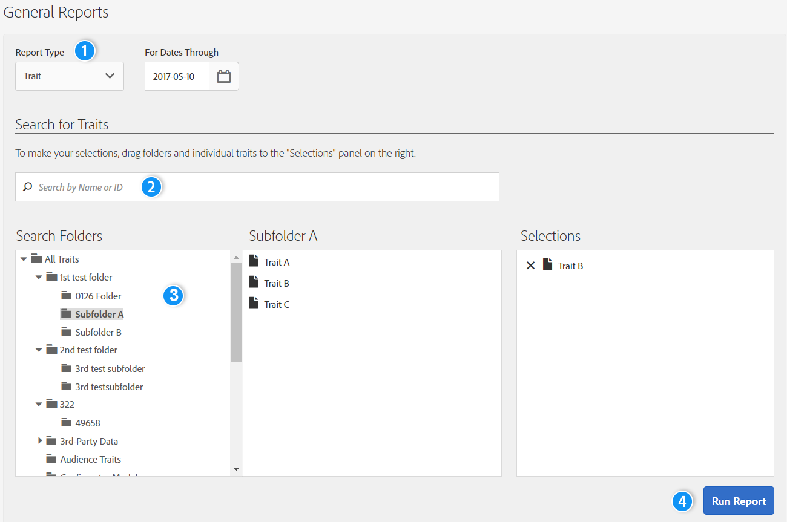

# Rapporti generali{#general-reports}

[!UICONTROL General] Un rapporto restituisce dati sulle prestazioni su caratteristiche, segmenti e destinazioni.

## Panoramica {#general-reports-overview}

<!-- 

c_general_reports.xml

 -->

[!DNL Audience Manager] uses [!UICONTROL Role Based Access Control] ([!UICONTROL RBAC]) per estendere le autorizzazioni del gruppo utenti ai [!UICONTROL General] rapporti. Gli utenti possono vedere solo le caratteristiche e i segmenti nei rapporti che possono visualizzare. [!UICONTROL RBAC] consente di controllare quali dei team interni di dati di reporting sono in grado di visualizzare. Ad esempio, un'agenzia che gestisce diversi account pubblicitari può configurare le autorizzazioni del gruppo di utenti in modo che un team che gestisce l'account dell'inserzionista A non possa vedere i dati di reporting dell'inserzionista B.

Eseguite [!UICONTROL General] un rapporto quando dovete:

* Rivedete le prestazioni per caratteristica, segmento o destinazione.
* Tieni traccia delle impression (totale e univoche) a intervalli di 1, 7, 14, 30, 60 e 90 giorni.
* Rivedete i conteggi totali e univoci dei caricamenti.
* Confronta le prestazioni e le prestazioni dei segmenti.
* Identificare caratteristiche di prestazioni e segmenti potenti o scadenti, analizzare la domanda o confrontare dati di carico/fuoco con rapporti di terze parti.
* Esportare dati (formato. csv) per un'ulteriore analisi e condivisione.

L'illustrazione seguente fornisce una panoramica di alto livello degli elementi chiave [!UICONTROL General] del report.

1. Configura le seguenti opzioni:

   * **Tipo di rapporto:** Selezionate il tipo di rapporto desiderato (Caratteristica, Segmento o Destinazione).

   * **Per le date tramite:** Specifica l'intervallo di date per il rapporto.

2. Cerca una caratteristica, un segmento o una destinazione per nome o ID.
3. Nell'elenco delle cartelle, trascina e rilascia le caratteristiche, i segmenti o le destinazioni che desideri includere nel [!UICONTROL Selections] pannello a destra.
4. Generare il rapporto da visualizzare in una tabella esportabile.

## Esecuzione di un rapporto generale {#run-general-report}

Questa sezione descrive come eseguire [!UICONTROL General] un rapporto e impostare il tempo e altre opzioni di prestazioni.

<!-- 

t_run_general_report.xml

 -->

1. Nel **[!UICONTROL Analytics]** dashboard, fate clic **[!UICONTROL General Reports]** su.
1. Dall'elenco **[!UICONTROL Report Type]** a discesa, selezionate il tipo desiderato: Caratteristica, Segmento o Destinazione.
1. *Condizionale* Fai clic sulla casella di data per visualizzare un calendario, quindi seleziona la data finale per il rapporto se desideri specificare una data diversa da oggi.
1. Cerca una caratteristica, un segmento o una destinazione per nome o ID.
1. Nell'elenco delle cartelle, trascina e rilascia le caratteristiche, i segmenti o le destinazioni che desideri includere nel [!UICONTROL Selections] pannello a destra.
1. Fai clic su **[!UICONTROL Run Report]**.

   I risultati vengono visualizzati in una tabella esportabile. Fai clic sulle intestazioni di colonna per ordinare i risultati in ordine crescente o decrescente.
1. Seleziona il pulsante di opzione desiderato nella parte superiore del rapporto per filtrare i dati per prestazioni ( [!UICONTROL Unique Trait Realizations], [!UICONTROL Total Trait Realizations]o [!UICONTROL Total Trait Population]) o per tempo (1, 7, 14, 30, 60 o 90 giorno).

   >[!NOTE]
   >
   >[!UICONTROL Total Trait Realizations] sono calcolate [!UICONTROL Rule-based Traits] solo per.

1. *Clic facoltativo***[!UICONTROL Export to CSV]**. Viene esportato l' [!UICONTROL Unique Trait Realizations]intervallo di [!UICONTROL Total Trait Realizations][!UICONTROL Total Trait Population] tutti i giorni.

## Risultati generali dei report descritti {#general-reports-explained}

I numeri in [!UICONTROL General Reports] vengono generati direttamente dal nostro [!UICONTROL User Profile Store]. I risultati riflettono il numero di utenti [!DNL Audience Manager] che sono contenuti nel backend al momento in cui questi numeri di reporting sono stati generati.

* Questi numeri non includono ID visitatore con traffico eccessivo. Il traffico dai bot viene filtrato prima di raggiungere il sistema di backend. Inoltre, durante un processo di pulizia settimanale viene eliminato anche il traffico dei bot.
* Se i dati immessi tramite elaborazione in entrata sono stati disabilitati per l' [!DNL Audience Manager] UUID, e questi ID includono utenti non più attivi nel nostro sistema, questi UUID non attivi [!DNL Audience Manager] non raggiungono mai e [!UICONTROL User Profile Store] non vengono segnalati.
* [!UICONTROL Total Trait Realizations] sono calcolate [!UICONTROL Rule-based Traits] solo per.

## Risultati generali dei report per caratteristiche {#general-report-results-traits}

Le metriche riportate di seguito sono disponibili quando si esegue un rapporto Generale e si seleziona **[!UICONTROL Trait]** come tipo di rapporto:

**Rappresentazione caratteristica univoca**

Questa metrica rappresenta il numero univoco di [ID utente univoci di Audience Manager (UUID)](../reference/ids-in-aam.md) idonei per la caratteristica nell'intervallo di tempo selezionato. Ad esempio, se un utente visita la pagina principale tre volte il 10/1, visualizzerai una Rappresentazione caratteristica univoca.

**Totale Izations It**

Questa metrica rappresenta la quantità totale di caratteristiche per la caratteristica nell'intervallo di tempo selezionato. Ad esempio, se un utente visita la pagina principale e quindi passa alle notizie tecniche e alle sezioni relative alle notizie sportive, questi vengono visualizzati nel report Generale come tre realizzazioni totali delle caratteristiche, e una singola caratteristica.

**Popolazione caratteristica totale**

Questa metrica rappresenta la quantità totale di UUID Audience Manager attualmente qualificata per la caratteristica. Utilizzate questo numero per comprendere la quantità totale di utenti utilizzabili per la segmentazione e il targeting. In genere, gli utenti rimangono parte di una caratteristica per [120 giorni](../features/traits/create-onboarded-rule-based-traits.md#set-expiration-interval). Ad esempio, un utente che visita la pagina principale tre volte oggi e non torna successivamente, rimarrà un utente in questa popolazione ogni giorno fino a 120 giorni da ora. A 120 giorni, verranno rimossi dalla popolazione. Leggi il nostro Riferimento alle caratteristiche [delle caratteristiche](../features/traits/trait-qualification-reference.md) per ulteriori esempi sulla differenza tra Izations Trait Realizations (Implementazioni caratteristica univoca) e Total Trait Population (Popolazione caratteristica totale).

L'illustrazione seguente mostra i risultati dell'esecuzione di un rapporto generale per il tipo di report Caratteristiche.

## Risultati generali dei report per i segmenti {#general-report-results-segments}

Le metriche riportate di seguito sono disponibili quando si esegue un rapporto Generale e si seleziona **[!UICONTROL Segment]** come tipo di rapporto:

**Popolazione segmento in tempo reale**

Questa metrica rappresenta il numero effettivo di visitatori unici visti in tempo reale per l'intervallo di tempo specificato e che sono stati qualificati per il segmento nel momento in cui sono stati visti da Audience Manager.

**Popolazione segmento totale**

Questa metrica rappresenta il numero totale di UUID Audience Manager idonei per il segmento entro il periodo di look-back selezionato. La popolazione di 1 giorni Totale segmenti rappresenta la base utente più accurata per il targeting.

>[!NOTE]
>
>Seleziona **[!UICONTROL Include Destination Mappings]** una suddivisione della popolazione del segmento per le destinazioni attivate.

L'illustrazione seguente mostra i risultati dell'esecuzione di un rapporto generale per il tipo di report Segmento.

## Risultati generali dei report per le destinazioni {#general-report-results-destinations}

Le metriche riportate di seguito sono disponibili quando si esegue un rapporto Generale e si seleziona **[!UICONTROL Destination]** come tipo di rapporto:

**Popolazione segmento in tempo reale**

Questa metrica rappresenta il numero effettivo di visitatori unici visti in tempo reale per l'intervallo di tempo specificato e che sono stati qualificati per il segmento nel momento in cui sono stati visti da Audience Manager.

**Popolazione segmento totale**

Questa metrica rappresenta il numero totale di UUID Audience Manager appartenenti a un segmento entro il periodo di look-back, che sono stati inviati a una destinazione.

L'illustrazione seguente mostra i risultati ottenuti dall'esecuzione di un rapporto generale per il tipo di report Destinazioni.

