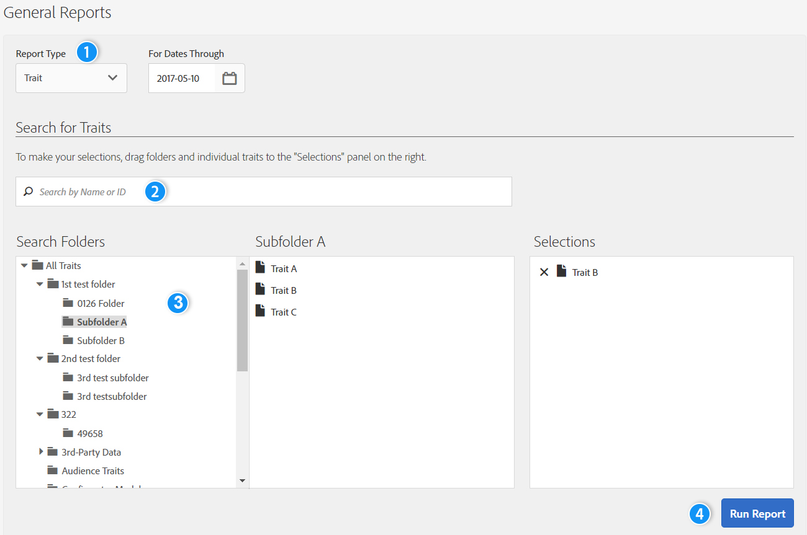
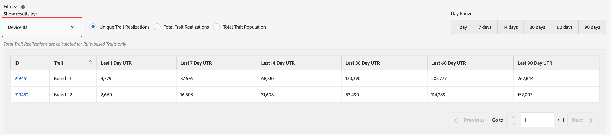
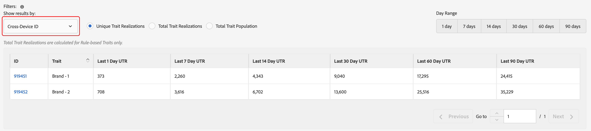
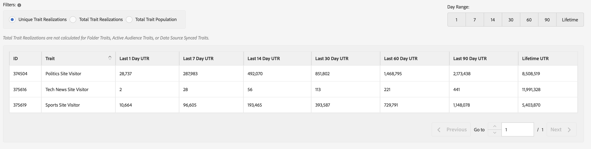
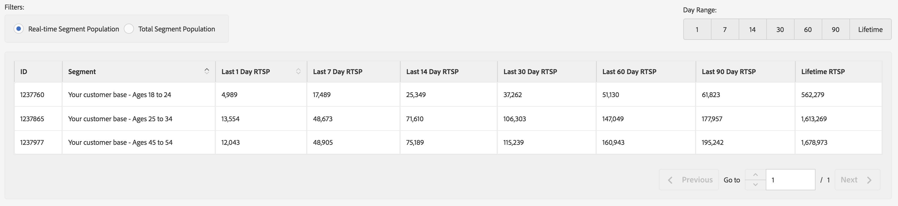
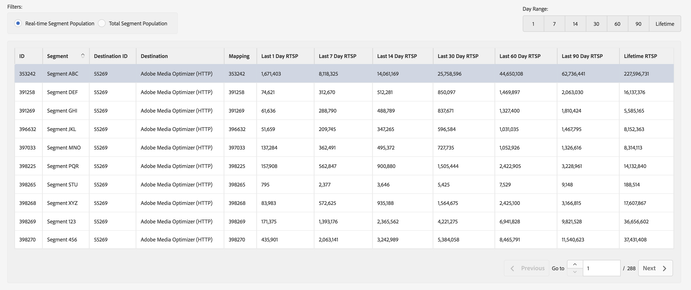

# Report generali{#general-reports}

Un report [!UICONTROL General] restituisce dati sulle prestazioni relativi a tratti, segmenti e destinazioni.

## Panoramica {#general-reports-overview}

<!-- 

c_general_reports.xml

-->

[!DNL Audience Manager] uses [!UICONTROL Role Based Access Control] ([!UICONTROL RBAC]) to extend user-group permissions to the [!UICONTROL General] reports. Users can see only those traits and segments in reporting that they have permissions to view. [!UICONTROL RBAC] functionality lets you control what reporting data internal teams are able to view. For example, an agency that manages different advertiser accounts can configure user-group permissions so that a team that manages Advertiser A&#39;s account cannot see Advertiser B&#39;s reporting data.

Run a [!UICONTROL General] report when you need to:

* Review performance by trait, segment, or destination.
* Track impressions (total and unique) at 1, 7, 14, 30, 60, and 90 day intervals.
* Verificare i conteggi dei carichi totali e univoci.
* Confrontare le prestazioni dei tratti e dei segmenti.
* Identificazione di segmenti e caratteristiche di prestazioni robuste o scarse, analisi della domanda o confronto dei dati relativi a carico/incendio con report di terze parti.
* Esporta i dati (formato .csv) per ulteriori analisi e condivisione.

Nella figura seguente viene fornita una panoramica di alto livello degli elementi chiave nel report [!UICONTROL General].

1. Configura le seguenti opzioni:

   * **Tipo di report:** Selezionare il tipo di report desiderato (Trait, Segment o Destination).

   * **Per le date fino a:**, specificare l&#39;intervallo di date per il report.

2. Cercare un tratto, un segmento o una destinazione in base al nome o all&#39;ID.
3. Dall&#39;elenco delle cartelle, trascina i tratti, i segmenti o le destinazioni che desideri segnalare nel pannello [!UICONTROL Selections] sul lato destro.
4. Genera il report da visualizzare in una tabella esportabile.

## Run a General Report {#run-general-report}

This section describes how to run a [!UICONTROL General] report and set time and other performance options.

<!-- 

t_run_general_report.xml

-->

1. In the **[!UICONTROL Analytics]** dashboard, click **[!UICONTROL General Reports]**.
1. Dall&#39;elenco a discesa **[!UICONTROL Report Type]**, seleziona il tipo desiderato: Tratti, Segmenti o Destinazione.
1. *Condizionale* Fare clic sulla casella della data per visualizzare un calendario, quindi selezionare la data di fine del report se si desidera specificare una data diversa da quella odierna.
1. Search for a trait, segment, or destination by name or ID.
1. From the folder list, drag and drop the traits, segments, or destinations you want to report to the [!UICONTROL Selections] panel on the right side.
1. Fare clic su **[!UICONTROL Run Report]**.

   Results display in an exportable table. Click the column headers to sort the results in ascending or descending order.
1. Select the desired option button at the top of the report to filter data by performance ( [!UICONTROL Unique Trait Realizations], [!UICONTROL Total Trait Realizations], or [!UICONTROL Total Trait Population]) or by time (1, 7, 14, 30, 60, or 90 day range).

   >[!NOTE]
   >
   >[!UICONTROL Total Trait Realizations] sono calcolati solo per [!UICONTROL Rule-based Traits].

1. *Facoltativo* Fare clic su **[!UICONTROL Export to CSV]**. Questa operazione consente di esportare [!UICONTROL Unique Trait Realizations], [!UICONTROL Total Trait Realizations] e [!UICONTROL Total Trait Population] per tutti gli intervalli di giorni.

## Descrizione dei risultati dei rapporti generali {#general-reports-explained}

I numeri in [!UICONTROL General Reports] sono generati direttamente da [!UICONTROL User Profile Store]. I risultati riflettono il numero di utenti che [!DNL Audience Manager] conteneva nel back-end al momento della generazione di questi numeri di report.

* Questi numeri non includono l&#39;ID del visitatore con traffico eccessivo. Il traffico dei bot viene filtrato prima di raggiungere il nostro sistema back-end. Inoltre, parte del traffico di bot viene eliminato durante un processo di pulizia settimanale eseguito nel backend.
* Se l&#39;UUID [!DNL Audience Manager] è stato bloccato tramite l&#39;elaborazione in entrata e questi ID includono utenti che non sono più attivi nel sistema, questi [!DNL Audience Manager] UUID inattivi non raggiungono mai [!UICONTROL User Profile Store] e non vengono segnalati.
* [!UICONTROL Total Trait Realizations] sono calcolati solo per [!UICONTROL Rule-based Traits].

## Risultati generali dei rapporti per i tratti {#general-report-results-traits}

I filtri seguenti sono disponibili quando si esegue un report Generale e si seleziona **[!UICONTROL Trait]** come tipo di report.

When filtering the results by [!UICONTROL Device ID]:

* [!UICONTROL Unique Trait Realizations] è il numero di visitatori anonimi del tuo dispositivo che hanno aggiunto la caratteristica al proprio profilo entro l&#39;intervallo di tempo selezionato.
* [!UICONTROL Total Trait Realization] è il numero totale di realizzazioni di tratti anonimi nell&#39;intervallo di tempo selezionato.
* [!UICONTROL Total Trait Population] è il numero di visitatori anonimi del tuo dispositivo che hanno questa caratteristica nel loro profilo.

Quando si filtrano i risultati per [!UICONTROL Cross-Device ID]:

* [!UICONTROL Unique Trait Realizations] è il numero di visitatori autenticati che hanno aggiunto il tratto al proprio profilo, entro l&#39;intervallo di tempo selezionato.
* [!UICONTROL Total Trait Realization] è il numero totale di realizzazioni di tratti autenticate nell&#39;intervallo di tempo selezionato.
* [!UICONTROL Total Trait Population] è il numero di visitatori autenticati che hanno questa caratteristica nel loro profilo.

<!-- 
### Unique Trait Realizations

This metric represents the unique number of [Audience Manager Unique User IDs (UUID)](../reference/ids-in-aam.md) that qualified for the trait in your selected time range. For example, if a user visited your homepage three times on 10/1, you would see one Unique Trait Realization.

### Total Trait Realizations

This metric represents the total amount of trait fires for the trait in your selected time range. For example, if a user visited your homepage, then navigated to your tech news and your sports news sections, they would appear in the General Report as three total trait realizations, and one unique trait realization.

### Total Trait Population

This metric represents the total amount of Audience Manager UUIDs that are currently qualified for the trait. Use this number to understand the total amount of users you could use for segmentation and targeting. Typically, users remain part of a trait for [120 days](../features/traits/create-onboarded-rule-based-traits.md#set-expiration-interval). For example, a user visiting your homepage three times today and never returning afterwards, would remain as a user in this population every day until 120 days from now. At the 120 day mark, they would be removed from the population. Read our [Trait and Segment Qualification Reference](../features/traits/trait-and-segment-qualification-reference.md) for more examples on the difference between Unique Trait Realizations and Total Trait Population.

The illustration below shows the results of running a general report for the Trait report type. 

-->

## Risultati dei rapporti generali per i segmenti {#general-report-results-segments}

Le metriche seguenti sono disponibili quando si esegue un report Generale e si seleziona **[!UICONTROL Segment]** come tipo di report:

### Popolazione dei segmenti in tempo reale

Questa metrica rappresenta il numero effettivo di visitatori univoci visualizzati in tempo reale per l&#39;intervallo di tempo specificato e qualificati per il segmento nel momento in cui sono stati visti dall&#39;Audience Manager.

### Popolazione segmento totale

Questa metrica rappresenta il numero totale di UUID Audienci Manager qualificati per il segmento nel periodo di riferimento selezionato. La popolazione di segmenti totali di 1 giorno rappresenta la base di utenti più accurata per il targeting.

>[!NOTE]
>
>Select **[!UICONTROL Include Destination Mappings]** to see a breakdown of segment population for activated destinations.

The illustration below shows the results of running a general report for the Segment report type.

## General Reports Results for Destinations {#general-report-results-destinations}

Le metriche seguenti sono disponibili quando si esegue un report Generale e si seleziona **[!UICONTROL Destination]** come tipo di report:

**Popolazione dei segmenti in tempo reale**

Questa metrica rappresenta il numero effettivo di visitatori univoci visualizzati in tempo reale per l&#39;intervallo di tempo specificato e qualificati per il segmento nel momento in cui sono stati visti dall&#39;Audience Manager.

**Total Segment Population**

This metric represents the total number of Audience Manager UUIDs belonging to a segment within the look-back period, that were sent to a destination.

The illustration below shows the results of running a general report for the Destinations report type.

