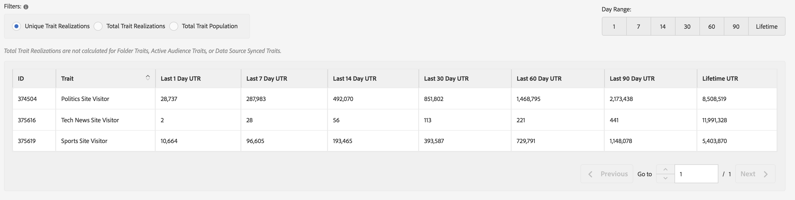

# General Reports{#general-reports}

[!UICONTROL General] Un rapporto restituisce dati sulle prestazioni su caratteristiche, segmenti e destinazioni.

## Panoramica {#general-reports-overview}

<!-- 

c_general_reports.xml

 -->

[!DNL Audience Manager] uses [!UICONTROL Role Based Access Control] ([!UICONTROL RBAC]) per estendere le autorizzazioni del gruppo utenti ai [!UICONTROL General] rapporti. Gli utenti possono vedere solo le caratteristiche e i segmenti nei rapporti che possono visualizzare. [!UICONTROL RBAC] consente di controllare quali dei team interni di dati di reporting sono in grado di visualizzare. Ad esempio, un'agenzia che gestisce diversi account pubblicitari può configurare le autorizzazioni del gruppo di utenti in modo che un team che gestisce l'account dell'inserzionista A non possa vedere i dati di reporting dell'inserzionista B.

Run a [!UICONTROL General] report when you need to:

* Rivedete le prestazioni per caratteristica, segmento o destinazione.
* Tracciare le impression (totale e univoca) a 1, 7, 14, 30, 60, 90 giorni e a intervalli di vita.
* Rivedete i conteggi totali e univoci dei caricamenti.
* Confronta le prestazioni e le prestazioni dei segmenti.
* Identificare caratteristiche di prestazioni e segmenti potenti o scadenti, analizzare la domanda o confrontare dati di carico/fuoco con rapporti di terze parti.
* Esportare dati (formato. csv) per un'ulteriore analisi e condivisione.

The following illustration provides a high-level overview of key elements in the [!UICONTROL General] report.

1. Configura le seguenti opzioni:

   * **Tipo di rapporto:** Selezionate il tipo di rapporto desiderato (Caratteristica, Segmento o Destinazione).

   * **Per le date tramite:** Specifica l'intervallo di date per il rapporto.

2. Cerca una caratteristica, un segmento o una destinazione per nome o ID.
3. From the folder list, drag and drop the traits, segments, or destinations you want to report to the [!UICONTROL Selections] panel on the right side.
4. Generare il rapporto da visualizzare in una tabella esportabile.

## Run a General Report {#run-general-report}

This section describes how to run a [!UICONTROL General] report and set time and other performance options.

<!-- 

t_run_general_report.xml

 -->

1. In the **[!UICONTROL Analytics]** dashboard, click **[!UICONTROL General Reports]**.
1. From the **[!UICONTROL Report Type]** drop-down list, select the desired type: Trait, Segment, or Destination.
1. *Condizionale* Fai clic sulla casella di data per visualizzare un calendario, quindi seleziona la data finale per il rapporto se desideri specificare una data diversa da oggi.
1. Cerca una caratteristica, un segmento o una destinazione per nome o ID.
1. From the folder list, drag and drop the traits, segments, or destinations you want to report to the [!UICONTROL Selections] panel on the right side.
1. Fai clic su **[!UICONTROL Run Report]**.

   I risultati vengono visualizzati in una tabella esportabile. Fai clic sulle intestazioni di colonna per ordinare i risultati in ordine crescente o decrescente.
1. Select the desired option button at the top of the report to filter data by performance ( [!UICONTROL Unique Trait Realizations], [!UICONTROL Total Trait Realizations], or [!UICONTROL Total Trait Population]) or by time (1, 7, 14, 30, 60, 90-day range or lifetime).

   >[!NOTE]
   >
   >[!UICONTROL Total Trait Realizations] sono calcolate [!UICONTROL Rule-based Traits] solo per.

1. *Clic facoltativo***[!UICONTROL Export to CSV]**. This exports the [!UICONTROL Unique Trait Realizations], [!UICONTROL Total Trait Realizations], and [!UICONTROL Total Trait Population] for all day ranges.

## General Reports Results Explained {#general-reports-explained}

The numbers in the [!UICONTROL General Reports] are generated directly from our [!UICONTROL User Profile Store]. The results reflect the number of users that [!DNL Audience Manager] contained in the backend at the time these reporting numbers were generated.

* Questi numeri non includono ID visitatore con traffico eccessivo. Il traffico dai bot viene filtrato prima di raggiungere il sistema di backend. Inoltre, durante un processo di pulizia settimanale viene eliminato anche il traffico dei bot.
* If you onboard data via inbound processing keyed off the [!DNL Audience Manager] UUID, and these IDs include users that are no longer active in our system, these inactive [!DNL Audience Manager] UUIDs never reach the [!UICONTROL User Profile Store] and are not reported.
* [!UICONTROL Total Trait Realizations] sono calcolate [!UICONTROL Rule-based Traits] solo per.

## General Reports Results for Traits {#general-report-results-traits}

The metrics below are available when you run a General report and select **[!UICONTROL Trait]** as the report type:

**Rappresentazione caratteristica univoca**

This metric represents the unique number of [Audience Manager Unique User IDs (UUID)](../reference/ids-in-aam.md) that qualified for the trait in your selected time range. Ad esempio, se un utente visita la pagina principale tre volte il 10/1, visualizzerai una Rappresentazione caratteristica univoca.

**Totale Izations It**

Questa metrica rappresenta la quantità totale di caratteristiche per la caratteristica nell'intervallo di tempo selezionato. Ad esempio, se un utente visita la pagina principale e quindi passa alle notizie tecniche e alle sezioni relative alle notizie sportive, questi vengono visualizzati nel report Generale come tre realizzazioni totali delle caratteristiche, e una singola caratteristica.

**Popolazione caratteristica totale**

Questa metrica rappresenta la quantità totale di UUID Audience Manager attualmente qualificata per la caratteristica. Utilizzate questo numero per comprendere la quantità totale di utenti utilizzabili per la segmentazione e il targeting. Typically, users remain part of a trait for [120 days](../features/traits/create-onboarded-rule-based-traits.md#set-expiration-interval). Ad esempio, un utente che visita la pagina principale tre volte oggi e non torna successivamente, rimarrà un utente in questa popolazione ogni giorno fino a 120 giorni da ora. A 120 giorni, verranno rimossi dalla popolazione. Read our [Trait Qualification Reference](../features/traits/trait-qualification-reference.md) for more examples on the difference between Unique Trait Realizations and Total Trait Population.

L'illustrazione seguente mostra i risultati dell'esecuzione di un rapporto generale per il tipo di report Caratteristiche.

## General Reports Results for Segments {#general-report-results-segments}

The metrics below are available when you run a General report and select **[!UICONTROL Segment]** as the report type:

**Popolazione segmento in tempo reale**

Questa metrica rappresenta il numero effettivo di visitatori unici visti in tempo reale per l'intervallo di tempo specificato e che sono stati qualificati per il segmento nel momento in cui sono stati visti da Audience Manager.

**Popolazione segmento totale**

Questa metrica rappresenta il numero totale di UUID Audience Manager idonei per il segmento entro il periodo di look-back selezionato. La popolazione di 1 giorni Totale segmenti rappresenta la base utente più accurata per il targeting.

>[!NOTE]
>
>Select **[!UICONTROL Include Destination Mappings]** to see a breakdown of segment population for activated destinations.

L'illustrazione seguente mostra i risultati dell'esecuzione di un rapporto generale per il tipo di report Segmento.

## General Reports Results for Destinations {#general-report-results-destinations}

The metrics below are available when you run a General report and select **[!UICONTROL Destination]** as the report type:

**Popolazione segmento in tempo reale**

Questa metrica rappresenta il numero effettivo di visitatori unici visti in tempo reale per l'intervallo di tempo specificato e che sono stati qualificati per il segmento nel momento in cui sono stati visti da Audience Manager.

**Popolazione segmento totale**

Questa metrica rappresenta il numero totale di UUID Audience Manager appartenenti a un segmento entro il periodo di look-back, che sono stati inviati a una destinazione.

L'illustrazione seguente mostra i risultati ottenuti dall'esecuzione di un rapporto generale per il tipo di report Destinazioni.

