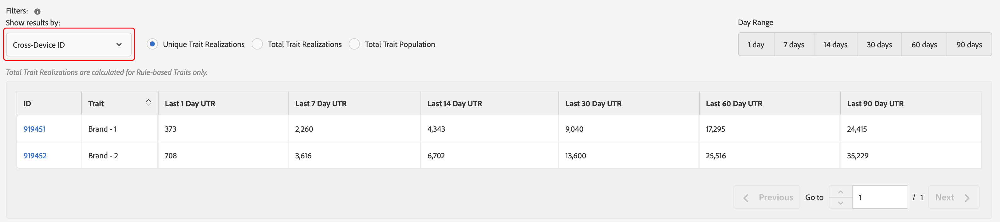

# Rapporti generali{#general-reports}

Un rapporto [!UICONTROL General] restituisce dati sulle prestazioni su caratteristiche, segmenti e destinazioni.

## Panoramica {#general-reports-overview}

<!-- 

c_general_reports.xml

 -->

[!DNL Audience Manager] utilizza  [!UICONTROL Role Based Access Control] ([!UICONTROL RBAC]) per estendere le autorizzazioni del gruppo di utenti ai  [!UICONTROL General] rapporti. Gli utenti possono visualizzare solo le caratteristiche e i segmenti nel reporting che dispongono delle autorizzazioni di visualizzazione. [!UICONTROL RBAC] consente di controllare quali dati possono essere visualizzati dai team interni. Ad esempio, un’agenzia che gestisce diversi account inserzionista può configurare le autorizzazioni per i gruppi di utenti in modo che un team che gestisce l’account dell’inserzionista A non possa visualizzare i dati di reporting dell’inserzionista B.

Esegui un rapporto [!UICONTROL General] quando devi:

* Esamina le prestazioni per caratteristica, segmento o destinazione.
* Tracciare le impression (totali e univoche) a intervalli di 1, 7, 14, 30, 60 e 90 giorni.
* Rivedi i conteggi di carico totali e univoci.
* Confrontare caratteristiche e prestazioni dei segmenti.
* Identifica caratteristiche e segmenti dalle prestazioni forti o insufficienti, analizza la domanda o confronta i dati di carico/incendio con i rapporti di terze parti.
* Esporta dati (formato .csv) per ulteriori analisi e condivisione.

La figura seguente fornisce una panoramica di alto livello degli elementi chiave del rapporto [!UICONTROL General] .

1. Configura le seguenti opzioni:

   * **Tipo di rapporto:** seleziona il tipo di rapporto desiderato (caratteristica, segmento o destinazione).

   * **Per Date previste:** specifica l’intervallo di date del rapporto.

2. Cerca una caratteristica, un segmento o una destinazione per nome o ID.
3. Dall’elenco delle cartelle, trascina e rilascia le caratteristiche, i segmenti o le destinazioni da includere nel rapporto nel pannello [!UICONTROL Selections] a destra.
4. Generare il report da visualizzare in una tabella esportabile.

## Eseguire un rapporto generale {#run-general-report}

Questa sezione descrive come eseguire un report [!UICONTROL General] e impostare l&#39;ora e altre opzioni di prestazioni.

<!-- 

t_run_general_report.xml

 -->

1. Nel dashboard **[!UICONTROL Analytics]**, fai clic su **[!UICONTROL General Reports]**.
1. Dall’elenco a discesa **[!UICONTROL Report Type]** , seleziona il tipo desiderato: Caratteristiche, segmento o destinazione.
1. ** CondizionaleFai clic sulla casella data per visualizzare un calendario, quindi seleziona la data di fine del rapporto se desideri specificare una data diversa da quella odierna.
1. Cerca una caratteristica, un segmento o una destinazione per nome o ID.
1. Dall’elenco delle cartelle, trascina e rilascia le caratteristiche, i segmenti o le destinazioni da includere nel rapporto nel pannello [!UICONTROL Selections] a destra.
1. Clic **[!UICONTROL Run Report]**.

   I risultati vengono visualizzati in una tabella esportabile. Fai clic sulle intestazioni di colonna per ordinare i risultati in ordine crescente o decrescente.
1. Seleziona il pulsante di opzione desiderato nella parte superiore del rapporto per filtrare i dati in base alle prestazioni ( [!UICONTROL Unique Trait Realizations], [!UICONTROL Total Trait Realizations] o [!UICONTROL Total Trait Population]) o in base al tempo (intervallo di 1, 7, 14, 30, 60 o 90 giorni).

   >[!NOTE]
   >
   >[!UICONTROL Total Trait Realizations] sono calcolati  [!UICONTROL Rule-based Traits] solo per .

1. ** FacoltativoFai clic su  **[!UICONTROL Export to CSV]**. Vengono esportati i valori [!UICONTROL Unique Trait Realizations], [!UICONTROL Total Trait Realizations] e [!UICONTROL Total Trait Population] per tutti gli intervalli di giorni.

## Spiegazione dei risultati dei report generali {#general-reports-explained}

I numeri nel [!UICONTROL General Reports] vengono generati direttamente dal nostro [!UICONTROL User Profile Store]. I risultati riflettono il numero di utenti contenuti nel backend [!DNL Audience Manager] al momento della generazione di tali numeri di reporting.

* Questi numeri non includono gli ID visitatore con traffico eccessivo. Il traffico proveniente dai bot viene filtrato prima di raggiungere il nostro sistema di backend. Inoltre, il traffico da bot viene scartato durante un processo di pulizia settimanale eseguito nel backend.
* Se effettui l’onboarding dei dati tramite elaborazione in entrata ricavata dall’ [!DNL Audience Manager] UUID e questi ID includono utenti che non sono più attivi nel nostro sistema, questi [!DNL Audience Manager] UUID inattivi non raggiungono mai il [!UICONTROL User Profile Store] e non vengono segnalati.
* [!UICONTROL Total Trait Realizations] sono calcolati  [!UICONTROL Rule-based Traits] solo per .

## Risultati dei report generali per le caratteristiche {#general-report-results-traits}

I filtri seguenti sono disponibili quando si esegue un rapporto Generale e si seleziona **[!UICONTROL Trait]** come tipo di rapporto.

Durante il filtraggio dei risultati per [!UICONTROL Device ID]:

* [!UICONTROL Unique Trait Realizations] è il numero di visitatori anonimi del dispositivo che hanno aggiunto la caratteristica al profilo entro l’intervallo di tempo selezionato.
* [!UICONTROL Total Trait Realization] è il numero totale di realizzazioni di caratteristiche anonime all’interno dell’intervallo di tempo selezionato.
* [!UICONTROL Total Trait Population] è il numero di visitatori del tuo dispositivo anonimi che hanno questa caratteristica sul loro profilo.

Durante il filtraggio dei risultati per [!UICONTROL Cross-Device ID]:

* [!UICONTROL Unique Trait Realizations] è il numero di visitatori autenticati che hanno aggiunto la caratteristica al loro profilo, entro l’intervallo di tempo selezionato.
* [!UICONTROL Total Trait Realization] è il numero totale di realizzazioni di caratteristiche autenticate nell’intervallo di tempo selezionato.
* [!UICONTROL Total Trait Population] è il numero di visitatori autenticati che hanno questa caratteristica sul loro profilo.

<!-- 
### Unique Trait Realizations

This metric represents the unique number of [Audience Manager Unique User IDs (UUID)](../reference/ids-in-aam.md) that qualified for the trait in your selected time range. For example, if a user visited your homepage three times on 10/1, you would see one Unique Trait Realization.

### Total Trait Realizations

This metric represents the total amount of trait fires for the trait in your selected time range. For example, if a user visited your homepage, then navigated to your tech news and your sports news sections, they would appear in the General Report as three total trait realizations, and one unique trait realization.

### Total Trait Population

This metric represents the total amount of Audience Manager UUIDs that are currently qualified for the trait. Use this number to understand the total amount of users you could use for segmentation and targeting. Typically, users remain part of a trait for [120 days](../features/traits/create-onboarded-rule-based-traits.md#set-expiration-interval). For example, a user visiting your homepage three times today and never returning afterwards, would remain as a user in this population every day until 120 days from now. At the 120 day mark, they would be removed from the population. Read our [Trait and Segment Qualification Reference](../features/traits/trait-and-segment-qualification-reference.md) for more examples on the difference between Unique Trait Realizations and Total Trait Population.

The illustration below shows the results of running a general report for the Trait report type. -->
<!-- 
 -->

## Risultati dei report generali per segmenti {#general-report-results-segments}

Le metriche riportate di seguito sono disponibili quando si esegue un rapporto Generale e si seleziona **[!UICONTROL Segment]** come tipo di rapporto:

### Popolazione di segmenti in tempo reale

Questa metrica rappresenta il numero effettivo di visitatori unici visti in tempo reale per l’intervallo di tempo specificato e qualificati per il segmento nel momento in cui sono stati visti dall’Audience Manager.

### Popolazione totale del segmento

Questa metrica rappresenta il numero totale di UUID Audienci Manager qualificati per il segmento entro il periodo di look-back selezionato. La popolazione totale del segmento di 1 giorno rappresenta la base utente più precisa per il targeting.

>[!NOTE]
>
>Seleziona **[!UICONTROL Include Destination Mappings]** per visualizzare una suddivisione della popolazione del segmento per le destinazioni attivate.

L’illustrazione seguente mostra i risultati dell’esecuzione di un rapporto generale per il tipo di rapporto Segmento.

## Risultati dei report generali per le destinazioni {#general-report-results-destinations}

Le metriche riportate di seguito sono disponibili quando si esegue un rapporto Generale e si seleziona **[!UICONTROL Destination]** come tipo di rapporto:

**Popolazione di segmenti in tempo reale**

Questa metrica rappresenta il numero effettivo di visitatori unici visti in tempo reale per l’intervallo di tempo specificato e qualificati per il segmento nel momento in cui sono stati visti dall’Audience Manager.

**Popolazione totale del segmento**

Questa metrica rappresenta il numero totale di UUID Audienci Manager appartenenti a un segmento nel periodo di look-back che sono stati inviati a una destinazione.

L’illustrazione seguente mostra i risultati dell’esecuzione di un rapporto generale per il tipo di rapporto Destinazioni .

