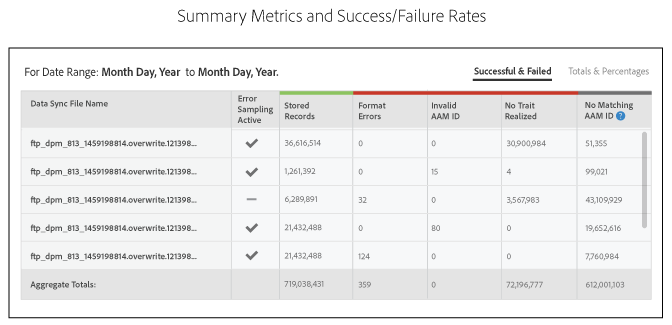

# Rapporto sullo stato di onboarding{#onboarding-status-report-about}

Il rapporto sullo stato di onboarding verifica i tassi di successo e di errore per l&#39;elaborazione dei record nei file di origine dati in ingresso. Questo rapporto visualizza i dati sotto forma di grafico a barre interattivo e fornisce metriche di riepilogo sotto forma di tabella. Prevede inoltre un’opzione per il campionamento dei file per un intervallo di tempo prefissato e la visualizzazione degli errori più comuni per ogni tipo di errore. Potete trovare questo rapporto in  Analytics > Onboarding Status Report (Rapporto sullo stato di onboarding). Questo rapporto è disponibile anche quando si crea un&#39;origine dati in ingresso.

>[!NOTE]
>
>Solo gli utenti con privilegi di amministratore possono visualizzare questo rapporto nell&#39;interfaccia  utente di Audience Manager. Potete fare in modo che gli utenti non amministratori ricevano una notifica dello stato dei file in entrata caricati aggiungendo le loro e-mail al rapporto. Consultate [Ricevere notifiche](/help/using/reporting/onboarding-status-report.md#receive-email-notifications)e-mail.

## Rapporto sullo stato di onboarding: Informazioni {#onboarding-status-about}

Il [!UICONTROL Onboarding Status Report] (Report errori campione) verifica i tassi d’errore e di successo nell’elaborazione dei record nei propri file di origine dei dati in ingresso. Questo rapporto visualizza i dati sotto forma di grafico a barre interattivo e fornisce metriche di riepilogo sotto forma di tabella. Prevede inoltre un’opzione per il campionamento dei file per un intervallo di tempo prefissato e la visualizzazione degli errori più comuni per ogni tipo di errore. Puoi trovare questo rapporto in **[!UICONTROL Analytics > Onboarding Status Report]**. Questo rapporto è disponibile anche quando si crea un&#39;origine dati in ingresso.

## Segnalazione errori e campionamento errori {#error-reporting-sampling}

La segnalazione degli errori e il campionamento degli errori sono due funzioni distinte del [!UICONTROL Onboarding Status] rapporto.

<table id="table_4706D891D4C545E8BF9D8A0CC052CC48"> 
 <thead> 
  <tr> 
   <th colname="col1" class="entry"> Funzione </th> 
   <th colname="col2" class="entry"> Descrizione </th> 
  </tr> 
 </thead>
 <tbody> 
  <tr> 
   <td colname="col1"> 
 <b>Segnalazione errori</b> 
 </td>
   <td colname="col2"> 
La segnalazione degli errori mostra i tassi di successo e di errore per il numero di record elaborati in un'origine dati in entrata. Restituisce i dati in un grafico a barre interattivo sovrapposto e sotto forma di metriche di riepilogo nelle tabelle sotto il grafico. 
 
La segnalazione degli errori è automatica. Viene eseguito in modo continuo per tutte le origini dati in entrata. Restituisce i dati in base all'intervallo di intervalli di tempo preimpostati o a un intervallo di tempo personalizzato impostato con un widget del calendario. 
 </td> 
  </tr> 
  <tr> 
   <td colname="col1"> 
 <b>Campionamento errori</b> 
 </td>
   <td colname="col2"> 
Il campionamento degli errori analizza il contenuto dei file di dati e restituisce i 10 errori più comuni per ogni tipo di errore. Gli errori nei file di dati in entrata impediscono l'elaborazione di singoli record. Utilizzate questo rapporto come strumento di risoluzione dei problemi per ridurre il numero di errori dei file e migliorare la frequenza di elaborazione. 
 
È necessario attivare manualmente il campionamento degli errori. Viene eseguito per 14 giorni dal giorno dell'attivazione e poi si spegne. Potete riattivare il campionamento degli errori dopo la scadenza dell’intervallo di 14 giorni. È possibile attivare il campionamento degli errori quando si <a href="../features/manage-datasources.md#create-data-source"> crea un'origine</a> dati in ingresso o selezionando la casella di controllo <b> Campionamento</b> errori dalla sezione  Impostazioni origine dati di un'origine dati in entrata esistente. 
 
Il campionamento degli errori è un processo che richiede calcoli. Di conseguenza, restituisce solo i primi 10 errori per ciascuna categoria di errori. Non è progettato per restituire tutti gli errori contenuti in un'origine dati in ingresso. Questi errori sono un esempio rappresentativo di un gruppo potenzialmente più ampio di errori simili. Rivedete l'intero file per i tipi di errori che questo rapporto contrassegna, riformattate il file e inviatelo di nuovo. 
 
Consulta Contenuti del file di dati <a href="../integration/sending-audience-data/batch-data-transfer-explained/inbound-file-contents.md"> in entrata: Sintassi, variabili ed esempi</a> per ulteriori informazioni su come formattare correttamente un file di dati per un'origine dati in entrata. 
 </td> 
  </tr> 
 </tbody> 
</table>

## Grafico a barre dei rapporti di errore {#error-report-bar-chart}

Il rapporto sugli errori rappresenta i tassi di successo e di errore per l&#39;elaborazione dei record in un grafico a barre sovrapposto, come illustrato nell&#39;esempio seguente. Il grafico è interattivo. Facendo clic su una barra vengono visualizzate le metriche di riepilogo relative al giorno specificato in una tabella sotto il grafico.

## Tabelle dei rapporti di errore {#error-report-tables}

Il rapporto sugli errori visualizza i dati tabulari sotto il grafico a barre. La tabella mostra i tassi di successo e di errore insieme ai totali e alle percentuali.

**Record con esito positivo e non riuscito**

Questa visualizzazione predefinita mostra il conteggio delle frequenze dei record totali nel rapporto e include una suddivisione degli errori per tipo di errore.

**Totali e percentuali**

Fate clic **[!UICONTROL Totals & Percentages]** per vedere la percentuale di file elaborati correttamente.

## Report di campionamento degli errori per 14 giorni {#error-reporting-14-days}

Con il campionamento degli errori attivo, il rapporto mostra i primi 10 errori per ogni tipo di errore. Fate clic sul pulsante del tipo di errore nella parte superiore del rapporto per visualizzare ogni insieme di dati campionati.

>[!NOTE]
>
>Il rapporto non evidenzia gli errori dei record con questa versione corrente. Per individuare e correggere gli errori dei file, è necessario esaminare i risultati e confrontarli con le specifiche indicate nella documentazione Contenuti [file di dati](../integration/sending-audience-data/batch-data-transfer-explained/inbound-file-contents.md) in entrata.

## Ricevi notifiche e-mail {#receive-email-notifications}

Potete aggiungere gli indirizzi e-mail dei destinatari ai quali desiderate ricevere una notifica dello stato dei file in entrata caricati. È possibile selezionare diversi destinatari per diverse origini dati.

## Creare un rapporto sullo stato di onboarding {#create-onboard-status-report}

A [!UICONTROL Sample Error Report] restituisce il numero di record elaborati correttamente in un&#39;origine dati e il numero di record che hanno avuto esito negativo. Per generare un [!UICONTROL Sample Error Report]oggetto, effettuate le seguenti operazioni.

<!-- 

create-onboarding-status-report.xml

 -->

1. Vai a **[!UICONTROL Analytics > Onboarding Status Report]**. Cercare un&#39;origine dati o sceglierne una dall&#39;elenco.

2. Seleziona un intervallo di date. Le opzioni includono:

   * Un insieme di intervalli di rapporti fissi.
   * widget calendario che consentono di creare un intervallo di date personalizzato.

3. Clic **[!UICONTROL OK]**.

## Termini e definizioni del rapporto sullo stato di onboarding {#report-terms-conditions}

Guida di riferimento per le etichette e i termini utilizzati in questo rapporto.

<table id="table_1D44A2E6B4C847848B818190DD336841"> 
 <thead> 
  <tr> 
   <th colname="col1" class="entry"> Termine </th> 
   <th colname="col2" class="entry"> Definizione </th> 
  </tr> 
 </thead>
 <tbody> 
  <tr> 
   <td colname="col1"> 
 <b>Nome file sincronizzazione dati</b> 
 </td> 
   <td colname="col2"> 
Elenca i file che  Audience Manager ha ricevuto ed elaborato dall'origine dati in ingresso selezionata. 
 
L'elaborazione del file non riuscirà se il nome del file viene formattato in modo errato. I requisiti relativi al nome del file variano a seconda di come vengono inviati i dati a  Audience Manager. I metodi di consegna includono  Amazon S3 e FTP. Per istruzioni su come assegnare un nome ai file, consultate: 
 
 
     <ul id="ul_9A32906A14CA41C5AED0E13930DB31BA"> 
      <li id="li_A5A0E6ED711D4002B52092619F87C7D6"> <a href="../integration/sending-audience-data/batch-data-transfer-explained/inbound-s3-filenames.md"> Requisiti di nome di Amazon S3 per file di dati in entrata </a> </li> 
     </ul> 
 </td> 
  </tr> 
  <tr> 
   <td colname="col1"> 
 <b>Errori di formato</b> 
 </td> 
   <td colname="col2"> 
Indica il numero di record che non hanno superato l'elaborazione perché non corrispondevano ai requisiti di sintassi o formattazione. Consulta Contenuti del file di dati <a href="../integration/sending-audience-data/batch-data-transfer-explained/inbound-file-contents.md"> in entrata: Sintassi, variabili ed esempi</a> per informazioni su come formattare i dati. 
 </td> 
  </tr> 
  <tr> 
   <td colname="col1"> 
 <b>ID AAM non valido</b> 
 </td> 
   <td colname="col2"> 
Mostra il numero di ID utente  Audience Manager (UUID) formattati in modo errato. Di solito, questo indica gli ID: 
 
    <ul id="ul_8304250E8F0F44918A50CF9D8D8D1F83"> 
     <li id="li_B100B4C2623B4E099E022869A4978357">Formato a 38 cifre non corrispondente. </li> 
     <li id="li_44E8A9AD13174A20A5742E56ED786634">Contiene caratteri alfabetici. Gli ID devono essere solo numeri. </li> 
    </ul> </td> 
  </tr>

<tr> 
   <td colname="col1"> 
 <b>ID dispositivo non valido</b> 
 </td> 
   <td colname="col2"> 
Mostra il numero di ID dispositivo globale formattati in modo errato. Consulta <a href="../reference/ids-in-aam.md">Indice degli ID in  Audience Manager</a> e Origini <a href="../features/global-data-sources.md">dati</a> globali per informazioni dettagliate sulla formattazione degli ID dispositivo e sulle origini dati globali da utilizzare in base al tipo di dispositivo.

  
La sezione relativa al campionamento degli errori del rapporto include informazioni dettagliate sugli ID dispositivo non validi, ad esempio:

   <ul>
    <li>ID origine dati corrispondente all'ID dispositivo non valido;</li>
    <li>ID dispositivo non valido;</li>
    <li>Il tipo di ID dispositivo previsto, in base all'origine dati.</li>
   </ul>
  </tr>

<tr> 
   <td colname="col1"> 
 <b>Nessun ID AAM corrispondente</b> 
 </td> 
   <td colname="col2"> 
Si tratta di ID caricati   Audience Manager non può corrispondere a un ID esistente. Gli ID caricati possono avere questo stato quando  Audience Manager non ha ancora eseguito la sincronizzazione ID o se non può comunque corrispondere all’ID anche dopo una sincronizzazione. 
 
Nel caso di ID mobili non associati,   Audience Manager : 
 
    <ul id="ul_B0D6AF9EB27D4017B35E36824B403879"> 
     <li id="li_D141000A50D3463182CBA4571DCC5373">Continuate a memorizzare e provate a sincronizzare questo ID. </li> 
     <li id="li_2EFCEE716F254ABCBC5FBF749B7564E6">Registralo come Record  memorizzato nel rapporto se l’ID non può essere sincronizzato. </li> 
    </ul> 
Se il file configurato contiene ID per dispositivi mobili, puoi trattare questi numeri in modo più leggero rispetto alle altre metriche. Non influiranno sulle percentuali di successo e di corrispondenza per i file successivi. 
 </td> 
  </tr> 
  <tr> 
   <td colname="col1"> 
 <b>Nessuna caratteristica realizzata</b> 
 </td> 
   <td colname="col2"> 
Elenca le caratteristiche che  Audience Manager non possono corrispondere a una caratteristica integrata. Ciò potrebbe essere il risultato di: 
 
    <ul id="ul_43619035AB6641B6949302FB50BDB5B1"> 
     <li id="li_D4C6306BF2B143198108702B309CE8CF">Caratteristiche formattate in modo errato nel file di dati in entrata. Per informazioni su come formattare il file di dati, vedere Contenuti del file di dati <a href="../integration/sending-audience-data/batch-data-transfer-explained/inbound-file-contents.md"> in entrata: Sintassi, variabili ed esempi</a>. </li> 
     <li id="li_A1C708A007D24EE09B7C629AFC6E43C3">Caratteristiche non ancora definite in  Audience Manager. </li> 
    </ul> </td> 
  </tr> 
  <tr> 
   <td colname="col1"> 
 <b>Percentuale di successo</b> 
 </td> 
   <td colname="col2"> 
Percentuale di record memorizzati correttamente nel file. Percentuale di successo = record elaborati / numero di record in un file. 
 </td> 
  </tr> 
  <tr> 
   <td colname="col1"> 
 <b>Record ricevuti</b> 
 </td> 
   <td colname="col2"> 
Numero totale di record ricevuti. Nella maggior parte dei casi, questo numero deve corrispondere al numero totale di record (righe) nel file di dati in entrata. 
 </td> 
  </tr> 
  <tr> 
   <td colname="col1"> 
 <b>Record memorizzati</b> 
 </td> 
   <td colname="col2"> 
Numero di record memorizzati correttamente. A causa di errori di formato del file, alcuni dei record ricevuti potrebbero non essere memorizzati da  Audience Manager. Il numero di record memorizzati può essere inferiore al numero di record ricevuti. 
 </td> 
  </tr> 
  <tr> 
   <td colname="col1"> 
 <b>Totale caratteristiche realizzate</b> 
 </td> 
   <td colname="col2"> 
Il numero di caratteristiche per tutti gli utenti in tutti i file in entrata che vengono memorizzati nella piattaforma Audience Manager  . 
 </td> 
  </tr> 
  <tr> 
   <td colname="col1"> 
 <b>Totale segnali non utilizzati</b> 
 </td> 
   <td colname="col2"> 
Numero totale di segnali non utilizzati ricevuti nel rapporto. Questo totale è basato sul numero totale di record memorizzati correttamente. 
 
Per ulteriori informazioni, consulta Rapporto  Segnali non utilizzati. 
 </td> 
  </tr> 
 </tbody> 
</table>
