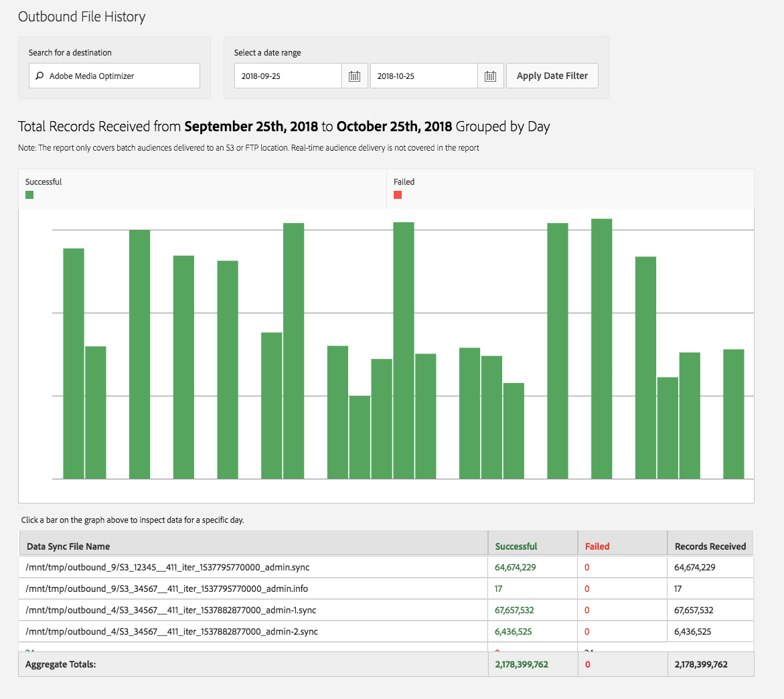

# Cronologia dei file in uscita {#outbound-file-history}

Visualizzare le informazioni sulla cronologia dei processi batch in uscita per una destinazione e un periodo di tempo specificati.

<!-- 

t_reports_outbound_history.xml

 -->

1. Fare clic su **[!UICONTROL Analytics]** > **[!UICONTROL Outbound File History]**.

   

1. Nella casella **[!UICONTROL Search for a Destination]**, iniziare a digitare e selezionare la destinazione desiderata.
1. Nella casella **[!UICONTROL Select a Date Range]**, specifica le date di inizio e fine per il report, quindi fai clic su **[!UICONTROL Apply Date Filter]**.

   

   La tabella seguente contiene informazioni corrispondenti alle colonne del rapporto:

<table id="table_93076D46AC50411395E72B9B987E99BE"> 
 <thead> 
  <tr> 
   <th colname="col1" class="entry"> Linee </th> 
   <th colname="col2" class="entry"> Descrizione </th> 
  </tr> 
 </thead>
 <tbody> 
  <tr> 
   <td colname="col1"> Nome file di sincronizzazione dati </td> 
   <td colname="col2"> 
Elenco di tutti i file in uscita generati da  Adobe per questa destinazione ed elaborati insieme. 
 </td> 
  </tr> 
  <tr> 
   <td colname="col1"> Completato </td> 
   <td colname="col2"> 
Numero di record inviati correttamente da  Audience Manager alla destinazione. 
 </td> 
  </tr> 
  <tr> 
   <td colname="col1"> Non riuscito </td> 
   <td colname="col2"> 
Numero di record che non è stato possibile inviare alla destinazione. 
 </td> 
  </tr> 
  <tr> 
   <td colname="col1"> Record ricevuti </td> 
   <td colname="col2"> 
Numero totale di record  Adobe generati nei file e che hanno tentato di inviare alla destinazione. Nella maggior parte dei casi, dovrebbe corrispondere al numero totale di file riusciti e di file non riusciti. 
 </td> 
  </tr> 
 </tbody> 
</table>
