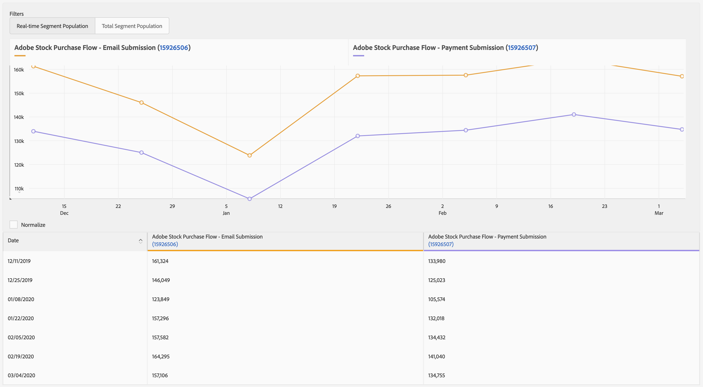

# Rapporti sulle tendenze{#trend-reports}

Un rapporto sulle tendenze restituisce dati sulle tendenze per caratteristiche e segmenti.

## Panoramica {#trend-report-overview}

<!-- 

c_trend_reports.xml

 -->

[!DNL Audience Manager] utilizza [!UICONTROL Role Based Access Control] ([!UICONTROL RBAC]) per estendere le autorizzazioni del gruppo di utenti a [!UICONTROL Trend] rapporti. Gli utenti possono visualizzare solo le caratteristiche e i segmenti per i rapporti che dispongono delle autorizzazioni di visualizzazione. [!UICONTROL RBAC] Questa funzionalità consente di controllare quali dati di reporting i team interni possono visualizzare.

Ad esempio, un’agenzia che gestisce account pubblicitari diversi può configurare le autorizzazioni per i gruppi di utenti in modo che un team che gestisce l’account dell’inserzionista A non possa visualizzare i dati di reporting dell’inserzionista B.

Esegui una [!UICONTROL Trend] segnala quando devi:

* Rivedi i dati di tendenza per caratteristiche e segmenti.
* Tracciare le tendenze con intervalli di 1, 7, 14, 30, 60 e 90 giorni.
* Confrontare le tendenze di caratteristiche e segmenti nel tempo.
* Identifica caratteristiche e segmenti con prestazioni potenti o insoddisfacenti.
* Esporta i dati (formato .csv) per ulteriori analisi e condivisioni.

La figura seguente fornisce una panoramica di alto livello degli elementi chiave della [!UICONTROL Trend] rapporto.

1. Configura le seguenti opzioni:
   **Tipo di rapporto:** Seleziona il tipo di rapporto desiderato (Caratteristica o Segmento).
   **Intervallo date:** Specifica l’intervallo di date per il rapporto (data di inizio e data di fine).
   **Intervallo di visualizzazione:** Specificare l&#39;intervallo di visualizzazione (intervalli di 1, 7, 14, 30, 60 e 90 giorni).
1. Cerca una caratteristica o un segmento per nome o ID.
1. Dall’elenco delle cartelle, trascina e rilascia le caratteristiche o i segmenti che desideri segnalare al [!UICONTROL Selections] sul lato destro.
1. Genera il rapporto da visualizzare in formato grafico oppure esportalo in formato CSV.

## Eseguire un rapporto sulle tendenze {#run-trend-report}

Questa procedura descrive come eseguire una [!UICONTROL Trend] rapporto.

<!-- 

t_working_with_trend_reports.xml

 -->

1. In **[!UICONTROL Analytics]** dashboard, fai clic su **[!UICONTROL Trend Reports]**.
1. Dalla sezione **[!UICONTROL Report Type]** selezionare il tipo desiderato: **[!UICONTROL Trait]** o **[!UICONTROL Segment]**.
1. Fare clic sulle caselle delle date per visualizzare un calendario, quindi selezionare le date di inizio e di fine per il report.
1. Specificare l&#39;intervallo di visualizzazione: 1, 7, 14, 30, 60 o 90 giorni.
1. Cerca una caratteristica o un segmento per nome o ID.
1. Dall’elenco delle cartelle, trascina e rilascia le caratteristiche o i segmenti che desideri segnalare al [!UICONTROL Selections] sul lato destro.
   * Per ottenere prestazioni ottimali, eseguire una [!UICONTROL Trend] generare rapporti su meno di 20 caratteristiche o segmenti alla volta.
1. Clic **[!UICONTROL Graph Traits]** o **[!UICONTROL Graph Segments]**, a seconda del tipo di rapporto che stai visualizzando (Caratteristiche o Segmenti). Queste opzioni ignorano tutte le cartelle e i grafici solo per singoli segmenti o caratteristiche selezionati.

   Oppure

   Clic **[!UICONTROL Export to CSV]** esportare i dati relativi alle caratteristiche o ai segmenti e tutte le cartelle in formato CSV per ulteriori analisi e condivisioni. Esporta il [!UICONTROL Unique Trait Realizations], [!UICONTROL Total Trait Realizations], e [!UICONTROL Total Trait Population] per tutti gli intervalli di giorni.

   >[!NOTE]
   >
   >[!UICONTROL Total Trait Realizations] sono calcolati per [!UICONTROL Rule-based Traits] solo.

1. (Facoltativo) Passa il puntatore del mouse su singole caratteristiche o segmenti per visualizzare il numero di visite e la data di ogni punto dati. Puoi fare clic sulle intestazioni di colonna nella tabella per ordinare i risultati in ordine crescente o decrescente.

## Risultati report tendenze per caratteristiche {#trend-report-results-traits}

I filtri riportati di seguito sono disponibili quando si esegue una [!UICONTROL Trend Report] e seleziona **[!UICONTROL Trait]** come tipo di report.

Quando si filtrano i risultati per [!UICONTROL Device ID]:

* [!UICONTROL Unique Trait Realizations] è il numero di visitatori anonimi del dispositivo che hanno aggiunto la caratteristica al loro profilo entro l’intervallo di tempo selezionato.
* [!UICONTROL Total Trait Realization] è il numero totale di realizzazioni delle caratteristiche del mouse anonimo nell’intervallo di tempo selezionato.
* [!UICONTROL Total Trait Population] è il numero di visitatori anonimi del dispositivo che hanno questa caratteristica sul loro profilo.

Quando si filtrano i risultati per [!UICONTROL Cross-Device ID]:

* [!UICONTROL Unique Trait Realizations] è il numero di visitatori autenticati che hanno aggiunto la caratteristica al loro profilo, entro l’intervallo di tempo selezionato.
* [!UICONTROL Total Trait Realization] è il numero totale di realizzazioni di caratteristiche autenticate nell’intervallo di tempo selezionato.
* [!UICONTROL Total Trait Population] è il numero di visitatori autenticati che hanno questa caratteristica sul loro profilo.

Gli zeri indicano che [!DNL Audience Manager] non ha raccolto dati per quel giorno. Le voci vuote indicano che la caratteristica non esiste.

Guarda il video seguente per uno sguardo dettagliato al funzionamento delle metriche tra dispositivi.

>[!VIDEO](https://experienceleague.adobe.com/docs/audience-manager-learn/tutorials/build-and-manage-audiences/profile-merge/understanding-cross-device-metrics-in-audience-manager.html)

## Risultati dei rapporti sulle tendenze per i segmenti {#segment-report-results-traits}

I filtri riportati di seguito sono disponibili quando si esegue una [!UICONTROL Trend Report] e seleziona **[!UICONTROL Segments]** come tipo di report.

* **[!UICONTROL Real-time Segment Population]**: il numero di visitatori idonei per il segmento all’interno dell’intervallo di tempo selezionato.
* **[!UICONTROL Total Segment Population]**: il numero totale di visitatori idonei per il segmento.

