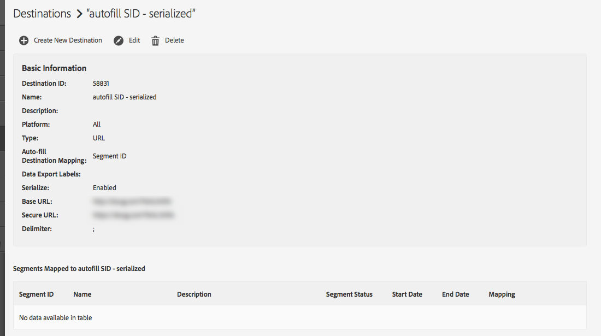

# Dovrei visualizzare i segmenti mappati da Audience Lab sulla pagina dei dettagli della destinazione? {#audience-lab-segments-destination-page}

## Domanda

Ho creato alcuni segmenti di test in [!UICONTROL Audience Lab] e li ho mappati su una destinazione. Tuttavia, quando li cerco nella pagina dei dettagli della destinazione, non li vedo.

Questo comportamento è normale o si tratta di un bug?

## Risposta

I segmenti mappati creati all’interno di [!UICONTROL Audience Lab] non vengono visualizzati nella pagina dei dettagli della destinazione.

Ad esempio, nelle schermate seguenti [!UICONTROL Test Segment 1] e [!UICONTROL Test Segment 2] sono mappati sulla destinazione [!UICONTROL autofill SID - serialized].

I segmenti vengono visualizzati nel test dei segmenti di Audience Lab:

I segmenti, tuttavia, non verranno visualizzati nella pagina dei dettagli della destinazione:

