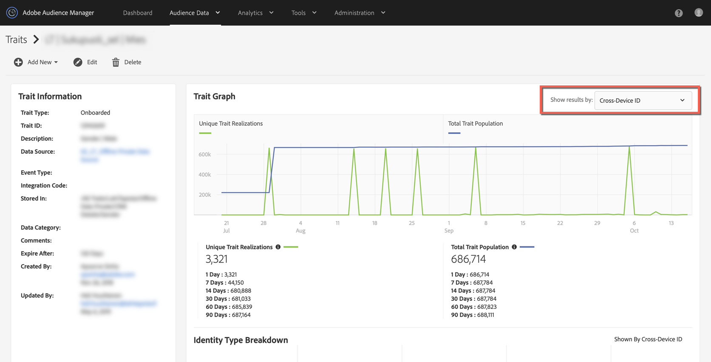

# Perché la mia popolazione di tratti caricati su un tablet è scesa a 0 intorno al 15 ottobre? {#why-did-my-onboarded-trait-populations-drop-to-0-around-october}

## domande

Intorno al 14 ottobre 2019 ho notato che le popolazioni di caratteristiche registrate per il grafico ID dispositivo sono scese a 0, dove in precedenza erano molto più alte. Perché è successo questo?

## Risposta

Il 15 ottobre, è stato modificato un aggiornamento alla funzionalità Regola di unione dei profili di Audience Manager in cui i dati caricati da un ID CRM caricato su un&#39;origine dati multi-dispositivo non venivano più realizzati rispetto agli ID dispositivo.  In precedenza Audience Manager si stava realizzando sia con l&#39;ID multi-dispositivo (o CRM ID) che copiando tali realizzazioni sugli UUID Audience Manager associati (ID dispositivo).  La modifica è stata apportata per riflettere più accuratamente la natura dei dati sulle caratteristiche e i profili realizzati.

Per visualizzare le realizzazioni delle caratteristiche, seleziona l&#39;opzione &quot;ID multi-dispositivo&quot; dall&#39;elenco a discesa nell&#39;angolo in alto a destra della vista Caratteristiche.

