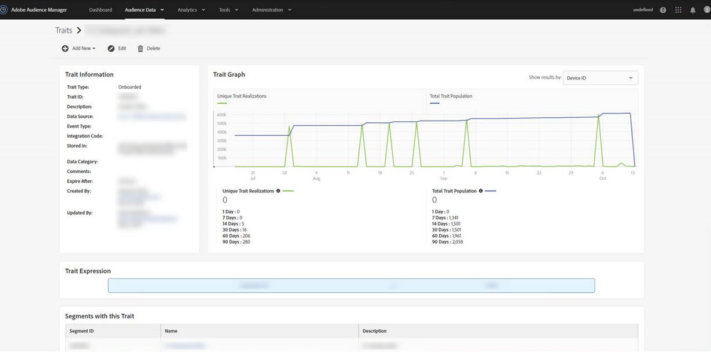

# Perché la mia popolazione di caratteristiche onboarded è scesa a 0 intorno al 15 ottobre? {#why-did-my-onboarded-trait-populations-drop-to-0-around-october}

## Domanda

Intorno al 14 ottobre 2019, ho notato che le popolazioni di caratteristiche onboarded per il grafico Device ID sono scese a 0, mentre in precedenza erano molto più alte. Perché è successo?

## Risposta

Il 15 ottobre, è stato modificato un aggiornamento della funzionalità Regole di unione profili di Audience Manager in base al quale i dati onboarded ricavati da un ID del sistema di gestione delle relazioni con i clienti caricato su una sorgente di dati multi-dispositivo non vengono più realizzati rispetto agli ID dispositivo.  In precedenza, Audience Manager effettuava le realizzazioni rispetto all’ID multi-dispositivo (o ID del sistema di gestione delle relazioni con i clienti) e copiava tali realizzazioni sugli UUID (ID dispositivo) di Audience Manager associati.  La modifica è stata apportata per riflettere più accuratamente la natura dei dati sulle caratteristiche e dei profili realizzati.

Per visualizzare le realizzazioni delle caratteristiche, seleziona l’opzione “Cross-Device ID” dall’elenco a discesa nell’angolo in alto a destra della vista Trait.

